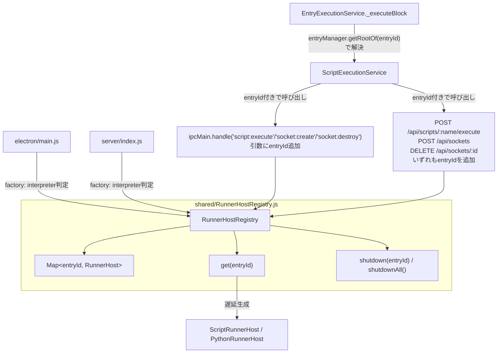

# レシピ単位の子プロセス分離

> Status: 設計具体化・実装は別issue(未実装)。作成日 2026-09-19。
> 前提ドキュメント: [main-area-multi-tab.md セクション7](main-area-multi-tab.md#7-将来の検討事項-レシピ単位の子プロセス分離)

## 背景・動機

将来のマルチタブ機能([main-area-multi-tab.md](main-area-multi-tab.md))実装時、1つの重い/ブロックするスクリプトが他の全レシピの実行を止めてしまう問題を避けるための先行設計。現時点で顕在化している不具合はなく、タブ機能実装に備えた予防的設計。

## スコープ

- 対象: Electron版(`electron/main.js`)・Webサーバー版(`server/index.js`+`server/api.js`)の両方。
- 本ドキュメントは設計の具体化のみを目的とし、実装は別issueとして後日着手する。
- マルチタブUI(タブの作成・削除・切替)自体はスコープ外。タブ削除時のプロセス破棄呼び出し(`shutdown(entryId)`)は、タブ機能実装時に呼び出し元を配線する前提でAPIのみ用意する。

## キー: `entryId`

タブ機能未実装の現時点でも、`EntryHierarchyHandler`は複数rootを内部的に保持できる設計であり、`SocketManager`/`EntryExecutionService`の通信ソケット管理は既に「rootのentryId」をキーに使っている(`EntryExecutionService.js:194` `this._entrySocketMap.set(entryId, { socketId: entryId })`)。将来のタブ機能におけるtabIdは、このentryId(root)のエイリアスとして後から乗せる想定。

新規に`rootId`/`tabId`という別名を導入せず、既存の呼称`entryId`に統一する。

## 設計



### 1. `shared/RunnerHostRegistry.js`(新規)

`entryId`をキーにした`RunnerHost`のプールを管理する。`ScriptRunnerHost`/`PythonRunnerHost`自体は無改修で、既存の「`forkFn`を受け取って遅延生成する」パターンをそのまま使う。

```js
export default class RunnerHostRegistry {
  constructor(createHostFn) {
    this._createHostFn = createHostFn // () => ScriptRunnerHost | PythonRunnerHost
    this._hosts = new Map() // entryId -> RunnerHost
  }

  get(entryId) {
    let host = this._hosts.get(entryId)
    if (!host) {
      host = this._createHostFn()
      this._hosts.set(entryId, host)
    }
    return host
  }

  shutdown(entryId) {
    const host = this._hosts.get(entryId)
    if (!host) return Promise.resolve()
    this._hosts.delete(entryId)
    return host.shutdown()
  }

  shutdownAll() {
    const hosts = [...this._hosts.values()]
    this._hosts.clear()
    return Promise.all(hosts.map(h => h.shutdown()))
  }
}
```

- `createHostFn`は「インタプリタ設定からRunnerHostを1個作る」ファクトリで、呼び出し元(`electron/main.js`/`server/index.js`)が現状の`interpreterName === 'python' ? new PythonRunnerHost(...) : new ScriptRunnerHost(...)`の判定をそのままクロージャとして渡す。インタプリタ選択はentryIdによらずアプリ全体で1つのグローバル設定を維持するため、`createHostFn`はentryIdを引数に取らない。
- `get(entryId)`は既存の`_ensureProcess()`と同じ「なければ作る、あれば返す」の遅延生成パターン。entryId単位でも「そのタブで最初にスクリプトを実行/ソケット接続した時点」まで実プロセスは起動されない(`RunnerHost`内部の`_ensureProcess()`が呼ばれるまでは`fork`/`spawn`されない)。

### 2. `electron/main.js`

```js
let runnerRegistry = null

function ensureRunnerRegistry() {
  if (runnerRegistry) return runnerRegistry
  runnerRegistry = new RunnerHostRegistry(() => {
    if (appSettings.script.interpreterName === 'python') {
      return new PythonRunnerHost(() => spawn(
        appSettings.script.interpreterPath,
        [getPythonRunnerPath(), appPaths.scriptsDir]
      ))
    }
    const runnerPath = path.join(__dirname, 'script-runner.cjs')
    return new ScriptRunnerHost(() => utilityProcess.fork(runnerPath, [appPaths.scriptsDir], {
      serviceName: 'scriptflow-runner',
      stdio: 'pipe'
    }))
  })
  return runnerRegistry
}
```

- `ipcMain.handle('script:execute', async (_evt, scriptName, inputParams, entryId) => ensureRunnerRegistry().get(entryId).executeScript(scriptName, inputParams))`
- `socket:create`/`socket:destroy`も同様に`entryId`引数を追加し、`ensureRunnerRegistry().get(entryId)`経由にする。
- `app.on('before-quit', ...)`は`runnerHost.shutdown()`から`runnerRegistry.shutdownAll()`に置き換える。

### 3. `server/index.js` / `server/api.js`

- `server/index.js`は`runnerHost`単体の代わりに`RunnerHostRegistry`インスタンスを生成し、`createApiRouter({ appPaths, runnerRegistry })`として渡す。
- `server/api.js`の各ハンドラは`req.body.entryId`(execute/create)または`req.query.entryId`(`DELETE /sockets/:id`はbodyを持たないため)を受け取り、`runnerRegistry.get(entryId)`を経由する。
- `shutdown()`(SIGINT/SIGTERM)は`runnerRegistry.shutdownAll()`を呼ぶ。

### 4. クライアント側: entryIdの解決と伝播

- `ScriptExecutionService.executeScript(scriptName, inputParams, entryId)` / `createSocket(socketId, host, port, entryId)` / `destroySocket(socketId, entryId)`のように、IPC/API呼び出しの引数に`entryId`を追加する。
- `EntryExecutionService._executeBlock(entryId, inputParams)`は、実行対象のブロックentryIdからルートを`const rootEntryId = this.entryManager.getRootOf(entryId)`で解決し、`scriptExecutionService.executeScript(command, inputParams, rootEntryId)`のように渡す。`executeEntry`/`_executeContainer`の再帰引数(`traceId`と同様の追加パラメータ)には手を入れない。
- `EntryExecutionService.createComm(entryId, host, port)`/`deleteComm(entryId)`は、呼び出し元(`CommSettingView`)が既にrootのentryIdを渡しているため変更不要。ただし`scriptExecutionService.createSocket`/`destroySocket`呼び出し箇所では、`entryId`(=socketId)をホスト選択キーとしても明示的に渡す(socketIdと値が一致するのは現状の実装都合であり、IPC/API層のルーティングキーとしては「socketIdと同じ値のentryId」ではなく独立した引数として明示する)。

### 5. タブ削除時のシャットダウン(将来配線)

`RunnerHostRegistry.shutdown(entryId)`をタブのxボタン押下ハンドラから呼ぶ想定。[main-area-multi-tab.md セクション5](main-area-multi-tab.md#5-タブ削除時のソケットルート削除)の「ルート削除・ソケット解放と同じタイミングで行う既存パターンの流用」に、`runnerRegistry.shutdown(entryId)`の呼び出しを追加するだけで済む。本ドキュメントの範囲では呼び出し元(タブ管理側)は未実装のため配線しない。

## 影響範囲まとめ

| ファイル | 変更内容 |
|---|---|
| `shared/RunnerHostRegistry.js`(新規) | Map管理・遅延生成・個別/一括shutdown |
| `electron/main.js` | `runnerHost`変数→`RunnerHostRegistry`、IPCハンドラに`entryId`引数追加、`before-quit`を`shutdownAll()`に変更 |
| `electron/preload.js` | `executeScript`/`createSocket`/`destroySocket`に`entryId`引数を追加して`ipcRenderer.invoke`に中継 |
| `server/index.js` | `runnerHost`変数→`RunnerHostRegistry`、SIGINT/SIGTERMを`shutdownAll()`に変更 |
| `server/api.js` | `runnerHost`注入→`runnerRegistry`注入、各ルートで`entryId`を読み取って`get(entryId)`経由に変更 |
| `client/services/script_execution/ScriptExecutionService.js` | 3メソッドに`entryId`引数を追加 |
| `client/services/entry_execution/EntryExecutionService.js` | `_executeBlock`で`getRootOf(entryId)`を解決して`executeScript`に渡す |

## 未決定事項(タブ機能実装時に確認)

- タブ削除時の`RunnerHostRegistry.shutdown(entryId)`呼び出しをどこに配線するか(タブ管理側のxボタンハンドラ、[セクション5](main-area-multi-tab.md#5-タブ削除時のソケットルート削除)を参照)。
- `DELETE /api/sockets/:id`で`entryId`をquery paramとして渡す具体的なAPI形状(例: `DELETE /api/sockets/:id?entryId=...`)。

## 変更しないもの

- `ScriptRunnerHost`/`PythonRunnerHost`自体(1インスタンス=1プロセスのシンプルな実装のまま)。
- インタプリタ選択(JS/Python)は引き続きアプリ全体で1つのグローバル設定(`appSettings.script`)。
- `shared/script-runner.js`(子プロセス側)のソケット管理(`sockets`ダブ Map、キーは`socketId`)。プロセスがentryIdごとに分離されることで、この`sockets` Mapは自然にentryIdごとに独立するため無改修。

---

## Issue化候補

**タイトル案:**
- レシピ(entryId)単位で子プロセス(ScriptRunnerHost/PythonRunnerHost)を分離する
- `RunnerHostRegistry`を導入し、script-runnerプロセスをentryIdごとにプールする

**ラベル:** enhancement, electron, server, design-ready
