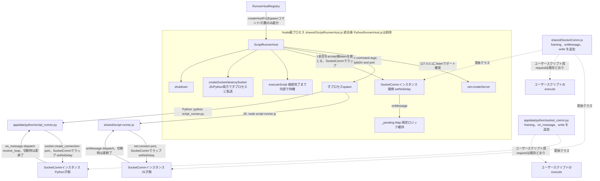

# ScriptRunnerHost/PythonRunnerHost 制御チャネルのソケット化

> Status: 設計合意、実装は別issue(未実装)。作成日 2026-09-20。
> 関連ドキュメント: [python-runner-ipc-comparison.md](python-runner-ipc-comparison.md)(旧検討・本ドキュメントで置き換え)、[recipe-process-separation-design-spec.md](recipe-process-separation-design-spec.md)(`RunnerHostRegistry`は変更なしで前提として利用)、[socket-comm-client-config-design-spec.md](socket-comm-client-config-design-spec.md)(`ClientConfig`設計は本ドキュメントの対象外だが、実装時に`command_delimiter`との整合を確認する)

## 背景・動機

現状、Node.js親プロセスと子プロセス(script-runner)間の制御通信は2系統に分かれている。

- **JS子プロセス**: `ScriptRunnerHost` ⇔ `shared/script-runner.js`。`utilityProcess.fork`/`child_process.fork`のネイティブIPC(`postMessage`/`process.send`)を使用。
- **Python子プロセス**: `PythonRunnerHost` ⇔ `appdata/python/script_runner.py`。`child_process.spawn`で起動し、NDJSON(1行1JSON)をstdin/stdoutでやり取り。stdoutを制御プロトコルが専有するため、ユーザースクリプトの`print()`は`_handle_execute`内で`sys.stdout`を`sys.stderr`にリダイレクトして退避している。

この2系統を両方ともTCPソケット経由の通信に統一する。動機は次の3点(すべて該当):

1. **JS/Pythonで通信方式を統一したい**: 実装方式(ネイティブIPC vs NDJSON stdio)がバラバラで、`ScriptRunnerHost`/`PythonRunnerHost`の重複ロジック(pending管理・タイムアウト・shutdown)を保守し続けるコストがある。
2. **ユーザースクリプトのstdin/stdoutを完全に解放したい**: 特にPython側の`sys.stdout`リダイレクトのような回避策を無くしたい。
3. **デバッグ/検証のしやすさ**: ソケットなら外部から接続して通信内容を覗ける。

`python-runner-ipc-comparison.md`ではPython単体について「追加pipe vs ソケット」を比較し追加pipeを推奨していたが、今回はJS側も含めた両方をソケット化する方針とし、本ドキュメントで置き換える。

## スコープ

- 対象: `ScriptRunnerHost`(JS子プロセスとの通信)と`PythonRunnerHost`(Python子プロセスとの通信)の両方。
- `RunnerHostRegistry`(entryIdごとのプール、[recipe-process-separation-design-spec.md](recipe-process-separation-design-spec.md)で実装済み)は変更しない。`createHostFn`の中身(インタプリタ判定によるspawnコマンドの選択)のみ単純化される。
- `shared/SocketComm.js`/`appdata/python/socket_comm.py`(ユーザースクリプトが外部ホストに接続するための既存の仕組み)は、本ドキュメントで**フレーミング機能を追加する形で拡張し**、子プロセスの制御チャネル用ソケットラッパーとしても再利用する(詳細は設計セクション参照)。ユーザースクリプトから見た`request()`の呼び出し方(データを渡して応答を受け取る)自体は変更しない。

## 設計判断まとめ

ヒアリングにより決定した論点。各項目の詳細・理由は該当する設計セクションを参照。

| 論点 | 決定内容 | 詳細 |
|---|---|---|
| 待受アドレス | 親プロセスの`net.createServer()`は`127.0.0.1`に固定する(外部ネットワークからの接続を排除) | [1](#1-接続の主従関係) |
| ポートの受け渡し | 起動引数(`argv`)で渡す。既存の`scriptsDir`と同じ経路に揃える | [1](#1-接続の主従関係) |
| 多重accept対策 | 子プロセスからの1本目をacceptしたら`server.close()`して以降の待受を止める | [1](#1-接続の主従関係) |
| 接続確立前の呼び出し | `executeScript`等は、接続完了まで`ScriptRunnerHost`内部で待機させてから送信する | [3](#3-sharedscriptrunnerhostjspythonrunnerhostjsを統合削除) |
| `spawnFn`のシグネチャ | `spawnFn()`(引数なし)から`spawnFn(port)`に変更する | [3](#3-sharedscriptrunnerhostjspythonrunnerhostjsを統合削除) |
| delimiterと`ClientConfig`の関係 | 当面は制御チャネル・`SocketComm`とも固定`\n`。`ClientConfig`実装時に同じ設定経由へ統一する方向で見直す | [2](#2-sharedsocketcommjs--appdatapythonsocket_commpy-の拡張) |
| `request()`の外部プロトコル互換性 | フレーミングは常時有効でよい(無効化オプションは用意しない。現状フレーミング非対応の外部プロトコルを使うスクリプトは存在しない) | [2](#2-sharedsocketcommjs--appdatapythonsocket_commpy-の拡張) |
| Python受信ループの終了方法 | `shutdown`受信時は例外を発生させてループを抜ける | [2](#2-sharedsocketcommjs--appdatapythonsocket_commpy-の拡張) |
| TCP Nagle対策 | 親・子双方のソケットに`setNoDelay(true)`相当を設定する | [2](#2-sharedsocketcommjs--appdatapythonsocket_commpy-の拡張) |
| 接続断・エラー時の挙動 | 制御チャネルが切れたら子プロセスは即座に終了する(現状のEOF検知と同等の扱い) | [4](#4-sharedscript-runnerjsjs子プロセス) / [5](#5-appdatapythonscript_runnerpy) |
| 既存テストの移行 | `shared/__tests__/PythonRunnerHost.test.js`を`shared/__tests__/ScriptRunnerHost.test.js`に統合する | [影響範囲まとめ](#影響範囲まとめ) |
| UI側の機能制限(調査済み) | `CommSettingView.vue`にインタプリタ判定による制限は存在せず、対応不要と確認済み | - |

## 設計

### 1. 接続の主従関係

Node側(`ScriptRunnerHost`)が`net.createServer()`で`127.0.0.1`に`listen(0)`し、OSが割り当てたポートを`server.address().port`で同期的に取得してから子プロセスをspawnする。子プロセスは起動時の引数(`argv`、既存の`scriptsDir`と同じ経路)で渡されたポートへ`connect`する。

- **逆(子プロセスがlisten、Node側がconnect)は不採用**: 子プロセスが確保したポート番号をNode側に伝える手段が(接続確立前の時点では)stdin/stdout以外に無く、解放したいstdioへの依存が再発するため。
- **待受アドレスは`127.0.0.1`に固定**する。外部ネットワークから制御チャネルに接続できてしまうリスクを避けるため、`0.0.0.0`やアドレス省略は使わない。
- ポート番号はプロセスごとに`listen(0)`で都度確保する(固定ポートの予約・衝突管理は行わない)。
- **1本目の接続をacceptしたら`server.close()`する**。子プロセスは1つしか起動しないため2本目以降の接続は想定外であり、待受を早期に閉じることで誤接続を防ぐ。
- **接続確立前の呼び出し**: `listen`→`spawn`→子プロセスの`connect`が完了するまでの間に`executeScript`/`createSocket`等が呼ばれる可能性があるため、`ScriptRunnerHost`は内部で「接続完了」を表すPromiseを保持し、各メソッドは送信前にそれを待ってから`socketComm.write(...)`する。呼び出し側(`EntryExecutionService`等)はこの待ち合わせを意識しなくてよい。

### 2. `shared/SocketComm.js` / `appdata/python/socket_comm.py` の拡張

制御チャネルでは親プロセスから任意のタイミングでコマンド(`execute`/`createSocket`/`destroySocket`/`shutdown`)が送られてくるため、現状の`request()`(「書く→次の1回の`data`/`recv`で解決」という単一往復型)だけでは対応できない。そこで両クラスに次を追加する。

- **フレーミング**: 受信バイト列を区切り文字(既定`\n`)が現れるまで内部バッファに蓄積し、完成した1メッセージ単位で扱う。`request(data)`もこのフレーミングを使うよう更新し、常に「ちょうど1メッセージ分」を返すようにする(現状の「次の`data`イベント/`recv(4096)`をそのまま返す」実装は、応答が複数パケットに分かれる場合や複数メッセージが連続する場合に取りこぼす可能性があった不具合の是正も兼ねる)。
  - フレーミングは常時有効とする(無効化オプションは用意しない)。現状`request()`を使うサンプルスクリプトは存在せず、改行区切りでない外部プロトコルに対応する実害は無いと判断した。
  - 区切り文字は当面`\n`固定とする。[socket-comm-client-config-design-spec.md](socket-comm-client-config-design-spec.md)の`ClientConfig.command_delimiter`(ユーザースクリプトの外部ホスト接続用、Python側は未実装)とは今回は連動させないが、`ClientConfig`実装時に制御チャネル・ユーザースクリプト双方が同じ設定経由でdelimiterを決められるよう見直す。
- **`onMessage(callback)`(JS)/ `on_message(callback)`(Python)**: `request()`とは独立に、受信したフレーム単位のメッセージ全てをコールバックへ渡す。制御チャネルの子プロセス側はこれを使って親から送られてくるコマンドを継続的に受け取る。
  - JS側: `SocketComm`が内部で保持する`net.Socket`の`'data'`イベントにフレーミング処理をフックし、完成したメッセージごとに登録済みコールバックを呼ぶ(Node標準の非同期I/Oにそのまま乗る形)。
  - Python側: ソケットは同期APIのため、登録したコールバックを呼び出し続けるブロッキングループ(`receive_loop()`。ネットワークの`listen`と紛らわしいため`listen`という名前は使わない)を`SocketComm`に追加する。`appdata/python/script_runner.py`の`main()`は、現状の`for line in sys.stdin`ループの代わりにこの`receive_loop()`を呼ぶ形になる。`shutdown`メッセージを受信したときは専用の例外(例: `ShutdownRequested`)を送出し、`receive_loop()`の呼び出し元がそれを`except`で捕捉して正常終了とみなす。
- **`write(data)`**: 応答を待たずにメッセージを1件送るだけのメソッド。制御チャネルでの応答送信は「受け取ったコマンドへの返信」であって`request()`が待っている相手ではないため、`request()`とは別に用意する。
- **`setNoDelay(true)`相当の設定**: デフォルトのTCPソケットはNagleアルゴリズム/遅延ACKにより小さいメッセージの送受信に数十ms程度の遅延が乗りうる(現状のパイプ/ネイティブIPCには無かった遅延)。`SocketComm`はコンストラクタで受け取ったソケットに対し、生成直後にこの設定を入れる。
- **接続断・エラー時の挙動**: ソケットの`'close'`/`'error'`(Python側は例外)を検知した場合、`SocketComm`はそれを利用側に伝播できるようにする(例: JSは`'close'`/`'error'`イベントを中継、Pythonは`receive_loop()`から例外を送出)。実際にプロセスを終了するかどうかの判断は呼び出し側(`script-runner.js`/`script_runner.py`)が行う(次項参照)。

この拡張により、制御チャネル(親⇔子の双方向)とユーザースクリプトの外部ホスト接続の両方が同じ`SocketComm`/`socket_comm.py`を実体として使う。ただし前者は`onMessage`/`write`による継続的なメッセージング、後者は`request()`による単発の往復という、異なる使い方をする。

### 3. `shared/ScriptRunnerHost.js`(`PythonRunnerHost.js`を統合・削除)

- コンストラクタは`spawnFn(port)`(呼び出し元でinterpreter判定を閉じ込めたファクトリ)を受け取るよう変更する。現状は`spawnFn()`(引数なし)だが、子プロセスの起動引数にポート番号を含める必要があるため、ポートを渡せる形に変える。`electron/main.js`/`server/index.js`側の「`interpreterName === 'python'`ならPythonインタプリタをspawn、そうでなければnodeでJSランナーをspawn」という判定はそのまま残るが、返す先が単一の`ScriptRunnerHost`になる。
- `_ensureProcess()`相当の遅延生成ロジックが「`127.0.0.1`に`listen(0)` → ポート取得 → spawn → 1本目の接続をaccept → `server.close()` → `new SocketComm(acceptedSocket)`でラップ(`setNoDelay`込み)」に変わる。この一連の処理が完了するまでを表すPromiseを保持し、`executeScript`等は送信前にそれを待つ。
- `_post`は`socketComm.write({ type, id, ... })`に、`_handleMessage`は`socketComm.onMessage(msg => ...)`で登録するコールバックになる。`{type, id, result/errmsg}`というメッセージ内容の契約自体は変更しない。
- `createSocket`/`destroySocket`は、JS/Pythonどちらの子プロセスに対しても`{type: 'createSocket', ...}`/`{type: 'destroySocket', ...}`を転送する(現状`PythonRunnerHost`側で無条件`Promise.resolve(null)`/`Promise.resolve(false)`を返しているスタブを廃止)。`appdata/python/script_runner.py`側は`_handle_create_socket`/`_handle_destroy_socket`自体は既に実装済みのため、コマンド転送を受け取る口としての新規実装は不要。ただし`SocketComm`を使い回すための内部修正は必要([5](#5-appdatapythonscript_runnerpy)参照)。
- `executeScript`のタイムアウト値(10秒)、`createSocket`/`destroySocket`のタイムアウト(10秒/5秒)、`shutdown`の強制kill猶予(2秒)は現状の値をそのまま維持する。

### 4. `shared/script-runner.js`(JS子プロセス)

- `process.parentPort`/`process.send`による送受信を、起動引数で渡されたポートへの`net.connect(port)`+`new SocketComm(socket)`に置き換える。
- `socketComm.onMessage(onMessage)`で登録し、現状の`onMessage`ディスパッチ(`execute`/`createSocket`/`destroySocket`/`shutdown`)にそのまま渡す。メッセージの意味・形式は変更しない。応答送信は`socketComm.write(...)`を使う。
- 制御ソケットの`'close'`/`'error'`を検知したら、即座にプロセスを終了する(現状のIPCチャネル終了時と同等の扱い。再接続は行わない)。
- `handleCreateSocket`/`handleDestroySocket`(ユーザースクリプト用の外部ソケット接続、`new SocketComm(socket)`をユーザースクリプトへ渡す部分)のロジックは変更しない。

### 5. `appdata/python/script_runner.py`

- `for line in sys.stdin`のループを、`socket.create_connection(('127.0.0.1', port))`で接続し`SocketComm`でラップした上での`receive_loop()`呼び出しに置き換える。
- `shutdown`メッセージ受信時は`SocketComm`が`ShutdownRequested`例外を送出し、`main()`側でそれを捕捉して通常終了する。
- 制御ソケットが切断・エラーになった場合(`receive_loop()`が`ShutdownRequested`以外の例外で終了した場合)は、即座にプロセスを終了する(再接続は行わない)。
- `_handle_execute`内の`sys.stdout = sys.stderr`リダイレクトを廃止する。制御プロトコルがソケット専用になるため、stdoutはユーザースクリプトの`print()`にそのまま使わせてよい。Node側は、この生のstdout出力を(JS版の`proc.stdout.on('data', d => console.log('[runner]', ...))`と同様に)診断ログとして扱う。
- 応答送信(`print(json.dumps(response), flush=True)`)も`socket_comm`インスタンスの`write(...)`に置き換える。
- ユーザースクリプト用の外部ソケット(`sock`)をラップする`SocketComm`は、`_handle_execute`が呼ばれる都度`new`するのではなく、[`shared/script-runner.js`の`scriptSocketComm`と同じパターン](#4-sharedscript-runnerjsjs子プロセス)で1回だけ生成して使い回す。具体的には`_handle_create_socket`が接続に成功した時点でモジュールレベルの`script_socket_comm`に`SocketComm(sock)`を格納し、`_handle_execute`はそれを`_load_and_call`に渡す。`_handle_destroy_socket`および切断時は`script_socket_comm`を`None`に戻す。Pythonの`SocketComm`は`receive_loop()`を明示的に呼ばない限りバックグラウンドで受信し続けないため、都度`new`してもJS版のようなリスナー積み上がりは起きないが、生成コストを避け実装をJS側と対称にする目的で同様の使い回しとする。

### 6. `electron/main.js` / `server/index.js`

- `utilityProcess.fork`によるJSランナー起動をやめ、`child_process.spawn(process.execPath, [runnerScriptPath, scriptsDir, String(port)])`のような形に統一する(Pythonランナーの起動方法と対称になる)。
- `RunnerHostRegistry`の`createHostFn`は、返す型が常に`ScriptRunnerHost`になる点、および`spawnFn`が`port`引数を受け取るようになる点以外は現状の「interpreterName判定でspawn方法を選ぶ」構造を維持する。

## 影響範囲まとめ

| ファイル | 変更内容 |
|---|---|
| `shared/PythonRunnerHost.js` | 削除 |
| `shared/ScriptRunnerHost.js` | Pythonロジックを統合、通信をlisten(127.0.0.1固定)+spawn+socket(`SocketComm`経由)に変更、`spawnFn`が`port`引数を取るよう変更、`createSocket`/`destroySocket`をJS/Python両方で転送するよう変更 |
| `shared/SocketComm.js` | フレーミング(delimiterまでバッファリング)、`onMessage`、`write`、`setNoDelay`を追加。`request()`はフレーミング済みの1メッセージを返すよう修正 |
| `shared/script-runner.js` | `net.connect(port)`+`SocketComm`で接続するよう変更(`parentPort`/`process.send`を廃止)。切断時は即終了 |
| `appdata/python/script_runner.py` | `socket.create_connection(port)`+`SocketComm`で接続するよう変更、stdoutリダイレクト廃止、切断時は即終了 |
| `appdata/python/socket_comm.py` | フレーミング、`on_message`+`receive_loop()`、`write`、`setNoDelay`相当を追加。`request()`はフレーミング済みの1メッセージを返すよう修正 |
| `electron/main.js` | `utilityProcess.fork`をやめてJSランナーもspawnに統一、`RunnerHostRegistry`の`createHostFn`を`spawnFn(port)`形に更新 |
| `server/index.js` / `server/api.js` | 変更なし(`RunnerHostRegistry`経由の呼び出しは[recipe-process-separation-design-spec.md](recipe-process-separation-design-spec.md)実装済みのまま) |
| `shared/__tests__/PythonRunnerHost.test.js` | `shared/__tests__/ScriptRunnerHost.test.js`に統合(実際に`appdata/python/script_runner.py`をspawnする既存の統合テストを、統合後の`ScriptRunnerHost`向けの呼び出し形(`spawnFn(port)`)に書き換えて移行) |

## 実装順序

依存関係(下位層の拡張が完了してから、それを使う側を変更する)に基づく順序。

1. ✅ **完了** — **`shared/SocketComm.js`**: フレーミング・`onMessage`・`write`・`setNoDelay`を追加。JS側の土台となるため最初に着手する。
2. ✅ **完了** — **`appdata/python/socket_comm.py`**: 同等の拡張(フレーミング・`on_message`+`receive_loop()`・`write`・`setNoDelay`相当)。1と依存関係はなく並行して進めてよい。
3. ✅ **完了** — **`shared/ScriptRunnerHost.js`**: `PythonRunnerHost`のロジックを統合し、`listen(127.0.0.1固定)`→spawn→accept→`SocketComm`ラップ、`spawnFn(port)`対応に変更する。1の拡張を前提とする。
4. ✅ **完了** — **`shared/script-runner.js`**: `parentPort`/`process.send`を`net.connect(port)`+`SocketComm`に置き換えた。起動引数は`argv[2]`にport、`argv[3]`にscriptsDir(当初案の順序から入れ替え)。送信は`post()`(`socketComm.write`のラッパー)、受信は`onMessage`で`JSON.parse`してから既存のディスパッチ(`execute`/`createSocket`/`destroySocket`/`shutdown`)にそのまま渡す。制御ソケットの`close`/`error`検知時は`process.exit(1)`で即終了する。なお`handleCreateSocket`/`handleDestroySocket`は当初案の「ロジックは変更しない」から一部変更されている: 外部ソケット用の`SocketComm`を`handleExecute`が呼ばれる都度`new`していると、常駐する外部ソケットに対してリスナー(`data`/`close`/`error`)が際限なく積み上がる問題があったため、`handleCreateSocket`の接続成功時に1回だけ生成して`scriptSocketComm`に保持し、`handleExecute`はそれを使い回す形に修正した。
5. ✅ **完了** — **`appdata/python/script_runner.py`**: `stdin`ループを`socket.create_connection`+`receive_loop()`に置き換え、stdoutリダイレクトを廃止した。`shutdown`受信時は`ShutdownRequested`例外を(`shared/script-runner.js`の`onMessage`と同名の)`on_message`コールバックから送出し、`receive_loop()`の呼び出し元(`main()`)がそれを`except`で捕捉して正常終了する。ユーザースクリプト用外部ソケットの`SocketComm`は`_handle_create_socket`成功時に1回だけ生成して`script_socket_comm`に保持し、`_handle_execute`はそれを使い回す(`_handle_destroy_socket`/`shutdown`/次の`createSocket`で`None`に戻す)。応答送信は`process_socket_comm.write(...)`に置き換えた。
6. ⬜ **未着手** — **`electron/main.js`**: JSランナー起動を`utilityProcess.fork`から`spawn`に統一し、`RunnerHostRegistry`の`createHostFn`を`spawnFn(port)`形に更新する。3・4・5がすべて揃ってから着手する(spawnコマンド/引数が両ランナーで確定している必要があるため)。
7. ✅ **完了(前倒し)** — **`shared/PythonRunnerHost.js`の削除**: 当初は6の後に予定していたが、3と同時に削除済み。このため5〜6が完了するまでは`electron/main.js`/`server/index.js`が削除済みの`PythonRunnerHost.js`を`import`し続けており、起動不可の状態になっている。
8. ⬜ **未着手** — **`shared/__tests__/PythonRunnerHost.test.js` → `shared/__tests__/ScriptRunnerHost.test.js`への統合**: 実プロセスをspawnする統合テストのため、1〜7がすべて完了した最後に、新しい`spawnFn(port)`呼び出し形へ書き換えて移行する。`PythonRunnerHost.js`削除により現時点で`npm test`は失敗する。

`server/index.js`/`server/api.js`は変更なしのため対象外。

## 検討した代替案(不採用)

- **子プロセスがlisten、Node側がconnect**: 子プロセスが確保したポートをNode側に伝える手段が(接続確立前の時点では)stdin/stdout以外になく、解放したいstdio依存が再発するため不採用。
- **制御チャネル専用の新規クラス(`ClientComm`)を追加する**: 当初検討したが、既存の`SocketComm`/`socket_comm.py`にフレーミング・`onMessage`・`write`を追加すれば同じ役割を果たせるため、新規クラスは追加せず既存クラスの拡張とした。`ScriptRunnerHost`の`_pending`/id/タイムアウト管理は、この拡張された`SocketComm`の上に乗る別レイヤーとして維持し、`SocketComm`自体には持たせない。
- **接続断時に再接続を試みる**: 子プロセットは1回のスクリプト実行ライフサイクルに閉じており、親プロセスが健在なら子プロセス自体を再spawnする経路(`RunnerHostRegistry`経由の再生成)が既にあるため、ソケットレベルでの再接続ロジックは追加せず即終了とした。

## 変更しないもの

- `RunnerHostRegistry`(entryIdごとのプール構造、[recipe-process-separation-design-spec.md](recipe-process-separation-design-spec.md)参照)。
- `{type, id, scriptName/result/errmsg, ...}`というメッセージ内容の契約そのもの。
- ユーザースクリプトから見た`SocketComm.request(data)`の呼び出し方(データを渡して応答を受け取る、という使用感)。内部実装(フレーミング)は変わる。
- `executeScript`/`createSocket`/`destroySocket`/`shutdown`の各タイムアウト値。

---

## Issue化候補

**タイトル案:**
- `ScriptRunnerHost`/`PythonRunnerHost`の制御チャネルをNDJSON stdio/ネイティブIPCからTCPソケットに統一する
- `SocketComm`/`socket_comm.py`にフレーミングと`onMessage`を追加し、`PythonRunnerHost`を`ScriptRunnerHost`に統合する

**ラベル:** enhancement, electron, server, python, design-ready
