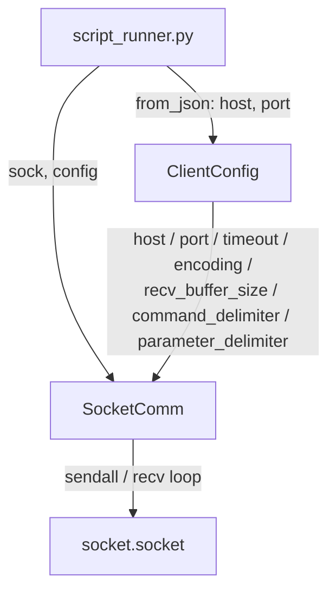

# ClientConfig: Communication Parameters for SocketComm

> Status: Design agreed, not yet implemented. Created 2026-09-19.

## Requirements

- Add a new class that holds the communication parameters used by `SocketComm` (Python side, `appdata/python/socket_comm.py`).
- Parameters to hold: `host`, `port`, `command_delimiter`, `parameter_delimiter`, `timeout`, `encoding`, `recv_buffer_size`.
- `command_delimiter` is used for **both** directions: it terminates a command being sent, and it marks where a received response ends.
- All parameters are fixed constants for this iteration — every attribute, including `host`/`port`, gets a hardcoded default in the constructor (which takes no arguments beyond `self`). Wiring them through the message protocol / UI is out of scope.
- The class has an instance method `from_json(json_str)` that sets its parameters from a JSON string. For any key absent from the JSON, the corresponding attribute is left unchanged (i.e. keeps whatever it was — the constructor default, unless already overridden). `host`/`port` from the `createSocket` message are applied this way, via `from_json`.
- Python-only. `shared/SocketComm.js` (the JS-side mirror) is not touched.

## Current code structure (premise)

- `appdata/python/socket_comm.py`: `SocketComm(sock)` wraps a connected `socket.socket`. `send(data)` does `sendall` then a single `recv(4096)` — no message framing, no configurable timeout/encoding.
- `appdata/python/script_runner.py`: `_handle_create_socket(msg)` opens the socket, hardcodes `sock.settimeout(10)`, connects to `msg['host']`/`msg['port']`, and stores the raw `socket.socket` in the `sockets` dict keyed by `socketId`. `_handle_execute` looks it up and constructs `SocketComm(sock)` with no other parameters.
- No script in the repo currently uses `socket_comm` (the only sample script, `appdata/scripts/add.py`, doesn't touch sockets), so there is no backward-compatibility constraint on `SocketComm`'s method signature.

## Design



### `ClientConfig` (new file: `appdata/python/client_config.py`)

Plain value object, no behavior beyond holding its attributes.

```python
class ClientConfig:
    def __init__(self):
        self.host = None
        self.port = None
        self.command_delimiter = '\n'
        self.parameter_delimiter = ','
        self.timeout = 10
        self.encoding = 'utf-8'
        self.recv_buffer_size = 4096
```

- The constructor takes no arguments beyond `self`; every attribute gets a fixed default (`host`/`port` default to `None` since they have no meaningful fixed value).
- `host`/`port` are set afterwards via `from_json` (see below), using the values from the `createSocket` message.

`from_json(json_str)` is an instance method: it parses `json_str` and overwrites `self`'s attributes for whichever of the 7 keys are present; any key missing from the JSON leaves that attribute unchanged.

```python
    def from_json(self, json_str):
        data = json.loads(json_str)
        for key in ('host', 'port', 'command_delimiter', 'parameter_delimiter',
                    'timeout', 'encoding', 'recv_buffer_size'):
            if key in data:
                setattr(self, key, data[key])
```

### `SocketComm` (updated)

- Constructor becomes `SocketComm(sock, config)`; stores both and applies `sock.settimeout(config.timeout)` once, at construction.
- `send(command, *args)`:
  1. Build the outgoing message: `config.parameter_delimiter.join([command, *args]) + config.command_delimiter`.
  2. Encode with `config.encoding`, `sendall`.
  3. Accumulate `config.recv_buffer_size`-sized chunks via `recv()` until the encoded `config.command_delimiter` appears in the buffer.
  4. Decode with `config.encoding`, strip the trailing delimiter, return the payload string.

### `script_runner.py` (updated)

- `_handle_create_socket` builds `config = ClientConfig()`, then `config.from_json(json.dumps({'host': msg.get('host'), 'port': msg.get('port')}))` to set `host`/`port` from the message, and stores both alongside the connected socket, e.g. `sockets[socket_id] = (sock, config)`.
- `_handle_execute` unpacks `(sock, config)` and constructs `SocketComm(sock, config)`.

## Rejected alternatives

- **`ClientConfig` also formats/parses messages** (`format_command`/`parse_response`), with `SocketComm` delegating to it as a pure transport shell. Rejected: makes the params class behavior-bearing, which no longer matches "just parameters"; more moving parts for the same outcome.
- **`ClientConfig` holds all fields but only `timeout`/`recv_buffer_size` are wired into `SocketComm`**, leaving delimiters/encoding unused for now. Rejected: doesn't deliver delimiter-based framing on send/receive, which was the actual requirement.

## Out of scope

- Wiring `command_delimiter`/`parameter_delimiter`/`timeout`/`encoding`/`recv_buffer_size` through the `createSocket` NDJSON message or `CommSettingView` UI — only `host`/`port` flow from there today.
- Any change to `shared/SocketComm.js` (JS side).

---

## Candidate issue

**Title options:**
- Add `ClientConfig` class to hold `SocketComm`'s communication parameters
- Introduce delimiter-based command framing in `SocketComm` via new `ClientConfig` class

**Labels:** enhancement, python
