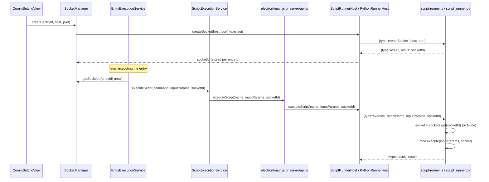

# Pass TCP/IP sockets into script execution (JS + Python runners)

> Status: planned, not yet implemented. Written 2026-09-06.

## Context

ScriptFlow already lets a user attach a TCP/IP socket to a Block entry via `CommSettingView.vue` → `SocketManager.create()`, which round-trips through `window.electronAPI.createSocket()` → `ScriptRunnerHost.createSocket()` → `shared/script-runner.js`'s `handleCreateSocket`, which opens a real `net.Socket` and hands back an opaque `socketId`. `destroySocket` mirrors this. This plumbing is JS-only and, critically, dead-ends: **the created socket is never actually given to the script that runs for that entry.** `inputParams` passed to `execute()` never carries a socket reference, on either the JS or Python runner.

Goal: when a Block entry has an associated (connected) socket, its script's `execute` function should receive that socket as a live object it can read/write directly — on both the JavaScript runner (`shared/script-runner.js`) and the Python runner (`appdata/script_runner.py`), which currently has no socket support whatsoever (`PythonRunnerHost.createSocket/destroySocket` are hardcoded stubs returning `null`/`false`).

Decided API shape: `execute(inputParams, socket)` — socket is a second positional argument (`null` if the entry has no connected socket), so `inputParams` stays exactly what's declared in `BlockDefinitions.json` and existing single-arg scripts keep working unchanged.

## Design

Python gets the same `createSocket`/`destroySocket` message handling added to `appdata/script_runner.py` (new `sockets` dict keyed by a generated id, using the stdlib `socket` module, blocking `connect`/`settimeout` — consistent with the worker's existing single-threaded, one-message-at-a-time model used for `execute`). `PythonRunnerHost` stops stubbing and does a real NDJSON round trip identical in shape to `ScriptRunnerHost`.

## Files to change

**Runner processes (core of the feature):**
- `shared/script-runner.js` — `handleExecute` gains `socketId`: look up `sockets.get(socketId) ?? null`, call `mod.execute(inputParams, socket)`.
- `appdata/script_runner.py` — add `sockets = {}` dict + `uuid`/`socket` imports; add `_handle_create_socket`/`_handle_destroy_socket` (mirroring the JS handlers: create+connect, store, self-contained try/except → `result: None` on failure; destroy → pop+close, always `result: True`); dispatch `createSocket`/`destroySocket` message types in `main()`; on `shutdown`, close all sockets before exiting; `_handle_execute` resolves `sockets.get(socket_id)` and calls `execute(input_params, sock)`.

**Host classes (thread `socketId` through `executeScript`, add real Python support):**
- `shared/ScriptRunnerHost.js` — `executeScript(scriptName, inputParams, socketId = null)` includes `socketId` in the posted `execute` message.
- `shared/PythonRunnerHost.js` — same `executeScript` signature change; replace the stubbed `createSocket()`/`destroySocket()` with real implementations posting `createSocket`/`destroySocket` NDJSON messages and awaiting the response (same pattern as `ScriptRunnerHost`, "never rejects" semantics preserved).

**IPC/HTTP boundary:**
- `electron/preload.js` — `executeScript: (name, inputParams, socketId) => ipcRenderer.invoke('script:execute', name, inputParams, socketId)`.
- `electron/main.js` — `ipcMain.handle('script:execute', ...)` forwards the extra `socketId` arg.
- `server/api.js` — `POST /scripts/:name/execute` body becomes `{ inputParams, socketId }` (was raw `inputParams`); route unpacks both before calling `runnerHost.executeScript`.

**Client wiring (resolve the entry's socketId at execution time):**
- `client/managers/SocketManager.js` — add `getSocketId(entryId)` returning the stored id or `null`.
- `client/services/script_execution/ScriptExecutionService.js` — `executeScript(scriptName, inputParams, socketId = null)`; Electron branch passes it through; Web branch sends `{ inputParams, socketId }` as the POST body.
- `client/services/entry_execution/EntryExecutionService.js` — constructor takes a `socketManager` reference; `_executeBlock` looks up `socketManager.getSocketId(entryId)` and passes it into `scriptExecutionService.executeScript(command, inputParams, socketId)`. Container entries don't execute scripts directly, so no change needed in `_executeContainer`.
- `client/main.js` — pass `socketManager` into the `EntryExecutionService` constructor call.

## Verification

- `npm test` — existing unit tests for `ScriptRunnerHost`/`PythonRunnerHost`/`EntryExecutionService`/`SocketManager` (check `__tests__/` dirs alongside each) should still pass; add/extend cases covering `socketId` threading through `executeScript` and the runner resolving it to a live socket.
- `npm run electron:start` — manually verify end-to-end: open a Block's Communication Setting, enable "Use TCP/IP com.", point it at a small local TCP echo listener, run the block with a script whose `execute(inputParams, socket)` writes/reads on `socket`, confirm it round-trips; also verify a script on a Block with no socket configured still runs fine with `socket === null`.
- Repeat the same end-to-end check with `appSettings.script.interpreterName` set to `"python"` (Python script using `sock.sendall`/`recv`) against the same local listener.
- `npm run lint`.
