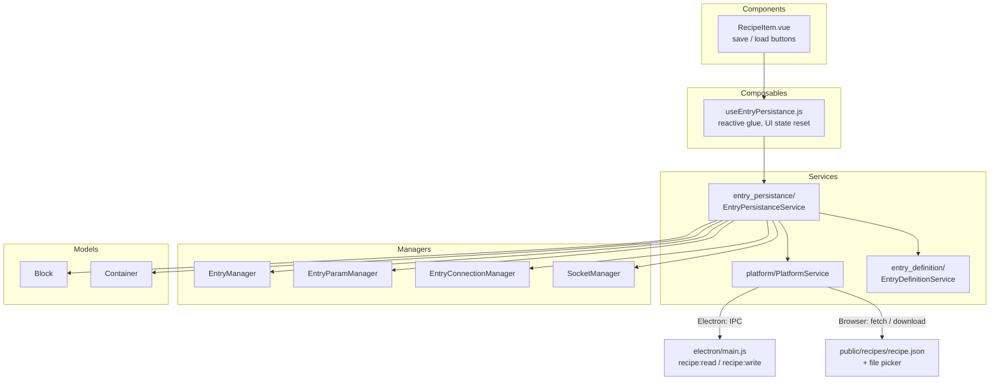
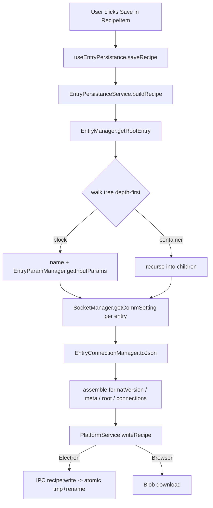
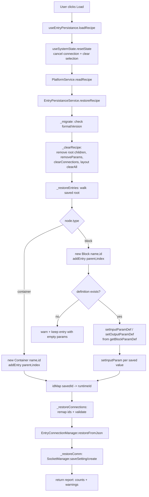
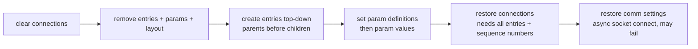

# EntryPersistanceService — Implementation Plan

Plan for saving and restoring a recipe (entry placement, parameter settings and
parameter connections) as `recipe.json`.

> Naming: the class is named `EntryPersistanceService` as requested in the issue.
> The directory follows the existing service-per-domain convention:
> `src/services/entry_persistance/EntryPersistanceService.js`.

---

## 1. Goal and scope

| In scope | Out of scope (for v1) |
| :--- | :--- |
| Entry tree (containers / blocks, order, nesting) | Undo / redo history |
| Input parameter values set by the user | Execution logs |
| Parameter connections (output → input) | Block definitions (`BlockDefinitions.json`, already persisted separately) |
| Per-entry TCP/IP communication settings | Script bodies (`scripts/*.mjs`, already persisted separately) |
| Recipe metadata (format version, name, timestamp) | Multiple recipe tabs (the UI currently has one fixed tab) |

A recipe is **a reference to block definitions plus user state**. Block
definitions are *not* embedded — the block name stays the join key, exactly as
`EntryExecutionService._executeBlock()` already resolves
`entryDefinitionService.getBlockDefinition(block.name).command` at run time.

---

## 2. What state exists today, and who owns it

| State | Owner | Access used for save | Access used for restore |
| :--- | :--- | :--- | :--- |
| Entry objects, parent/child, order | `EntryManager` (`_entriesById`, `_parentIdById`) | `getRootEntry()`, `entry.children` | `addEntry(parentId, entry, index)` |
| Entry identity (`id`, `name`, `type`) | `Entry` / `Block` / `Container` models | direct read | `new Block(name, id)` / `new Container(name, id)` (constructors already accept an id) |
| Input / output params `{ value, dataType }` | `EntryParamManager` | `getInputParams(id)` | `setInputParamDef()` + `setInputParam()` |
| Connections `{ id, output, input }` | `EntryConnectionManager` | `toJson()` (**already implemented**) | `restoreFromJson()` (**already implemented**) |
| TCP/IP settings per entry | `SocketManager` (`_entrySettingMap`) | `getCommSetting(id)` | `saveSetting()` + `create()` |
| Measured Y/height of each entry | `EntryLayoutManager` | — (recomputed by `useEntryRect`) | — |
| Selection / drag / connect-in-progress | `useSystemState` (module-level refs) | — (transient) | `resetState()` before restore |

`EntryConnectionManager` already has `toJson()` / `restoreFromJson()` /
`loadFromJsonFile()` (`src/managers/EntryConnectionManager.js:224-298`).
`EntryPersistanceService` **delegates** to those two rather than reimplementing
them; `loadFromJsonFile()` becomes redundant (it goes through
`FileService.readJsonFile()`, i.e. `fetch`, which does not work for
user-writable Electron paths) and should be removed once the service lands.

---

## 3. Placement in the four-layer architecture



Rules applied:

- The service is a **stateless facade**: no `ref`/`reactive`, no Vue import.
  All managers and `PlatformService` are injected through the constructor, the
  same way `EntryExecutionService` receives its collaborators in
  `src/main.js:32-34`.
- Tree mutation goes exclusively through `EntryManager` methods (never through
  `children` arrays) — required by CLAUDE.md.
- The composable owns only Vue-side concerns: busy flag, error message,
  `resetState()` / `clearSelection()`.

---

## 4. `recipe.json` schema (formatVersion 1)

```jsonc
{
  "formatVersion": 1,
  "meta": {
    "name": "My recipe",
    "savedAt": "2026-07-31T02:00:00.000Z",
    "appVersion": "0.1.0"
  },
  "root": {
    "id": "5d2c...-root",
    "type": "container",
    "name": "root-container",
    "comm": { "useTcpIp": true, "host": "192.168.0.1", "port": 8080 },
    "children": [
      {
        "id": "a1b2...",
        "type": "block",
        "name": "Add",
        "inputParams": { "NumberA": 3, "NumberB": 4 }
      },
      {
        "id": "c3d4...",
        "type": "container",
        "name": "Container",
        "children": [
          {
            "id": "e5f6...",
            "type": "block",
            "name": "Mul",
            "inputParams": { "NumberA": 0, "NumberB": 5 }
          }
        ]
      }
    ]
  },
  "connections": [
    {
      "id": "9a8b...",
      "output": { "entryId": "a1b2...", "category": "output", "dataType": "integer", "paramName": "Result" },
      "input":  { "entryId": "e5f6...", "category": "input",  "dataType": "integer", "paramName": "NumberA" }
    }
  ]
}
```

Design notes:

- **Nested `root`, not a flat list.** The tree *is* the ordering information;
  array position = child index, so no explicit `index` field is needed and the
  file cannot express an inconsistent order.
- **`connections` stays flat and top-level**, byte-compatible with the object
  `EntryConnectionManager.toJson()` already emits, so that method can be reused
  verbatim and `restoreFromJson(recipe)` can be fed the whole recipe object.
- **Only input parameter values are stored.** Output values are execution
  results and are re-derived on the next run. `dataType` is *not* stored per
  value either — it is re-read from `BlockDefinitions.json` via
  `EntryDefinitionService.getBlockParamDef(name)`, so a definition edit
  (e.g. `integer` → `real`) propagates to old recipes instead of being frozen.
  `EntryParamManager.setInputParam()` already runs `convertValue()`.
- **`command` is deliberately not stored** — the block name is the only link to
  the definition, matching the current execution path.
- **`comm`** is emitted only for entries that have a stored setting
  (currently only the root container, which is what `RecipeItem.vue:43` passes
  to `CommSettingView`), but the schema allows it on any entry so nothing has to
  change when per-block settings arrive.
- **`formatVersion`** gates a `_migrate(data)` step so future schema changes do
  not break existing files.

---

## 5. Save flow



Algorithm (`buildRecipe()` → plain object, `saveRecipe(name)` → persists it):

1. `root = entryManager.getRootEntry()`; abort with an error if null.
2. Depth-first serialise: `{ id, type, name }`, plus
   `inputParams: entryParamManager.getInputParams(id)` for blocks, plus
   `children: [...]` for containers, plus `comm` when
   `socketManager.getCommSetting(id)` is non-null.
3. `connections: entryConnectionManager.toJson().connections`.
4. Stamp `formatVersion`, `meta.savedAt`, `meta.name`.
5. Hand the object to `platformService.writeRecipe(fileName, data)`.

Keeping `buildRecipe()` separate from `saveRecipe()` makes the serialiser
directly unit-testable and reusable for "export"/clipboard later.

---

## 6. Restore flow



### 6.1 The root-container problem

`EntryManager._setRoot()` (`src/managers/EntryManager.js:26-32`) is guarded by
`if (this._rootId == null)`, and the root is created once in `RecipeItem.vue`
`setup()` via `addContainer(null, 'root-container', 0)`. A restored recipe
therefore **cannot** install its own root instance.

Resolution: restore *into* the existing runtime root. The saved root's `id`
differs from the live root's `id`, so the service maintains

```js
idMap = new Map([[savedRoot.id, liveRoot.id]])   // non-root ids map to themselves
```

and rewrites every `connections[].output.entryId` / `input.entryId` through
`idMap` before handing them to `EntryConnectionManager.restoreFromJson()`. The
same map is what an "import/merge into current recipe" feature would later use
to regenerate *all* ids and avoid collisions — so the indirection is worth
having even though v1 maps non-root ids to themselves.

Optionally also apply the saved root's `name` to the live root.

### 6.2 Teardown before restore (`_clearRecipe`)

Order matters:

1. `entryConnectionManager.clearConnections()` — before entries disappear.
2. For every id in `entryManager.getAllDescendantIds(rootId)` except the root:
   `entryParamManager.removeParams(id)` and
   `entryLayoutManager.deleteLayout(id)`.
   **Note an existing leak:** `useEntryOperation.removeEntry()` (`src/composables/useEntryOperation.js:32-42`)
   never calls `removeParams()`, so parameter maps currently grow forever.
   The persistence path must not inherit that; fixing `removeEntry()` too is a
   small, separate improvement worth doing in the same PR.
3. `entryManager.removeEntry(childId)` for each direct child of the root
   (this recursively drops descendants and rebuilds sequence numbers).
4. `socketManager.release(rootId)` if a socket is open.

### 6.3 Validation rules applied while restoring

`EntryConnectionManager.restoreFromJson()` validates endpoint *shape* and
duplicates only. The service adds semantic validation, collecting warnings
instead of throwing so a partially-valid recipe still loads:

| Rule | Action on violation |
| :--- | :--- |
| `formatVersion` unknown / newer than supported | abort, return error |
| Node `type` not `block`/`container` | skip node and its subtree, warn |
| Block name absent from `BlockDefinitions.json` | keep the entry (so the user can see and fix it), no params, warn |
| Saved input param name absent from the definition | ignore that value, warn (`setInputParam` already no-ops) |
| Connection endpoint `entryId` not in the restored tree | drop the connection, warn |
| Connection `paramName` no longer exists on that entry | drop the connection, warn |
| Connection direction violates DFS order (`getSequenceNumber(output) >= getSequenceNumber(input)`) — the invariant enforced interactively by `useSystemState.isConnectingTarget` | drop the connection, warn |
| Endpoint `dataType` differs from the current definition | keep, but warn (a definition edit should be visible, not silently fatal) |

`restoreRecipe()` returns a report:
`{ entryCount, connectionCount, warnings: string[] }` so the composable can
surface it (log popup or a toast) rather than failing silently.

---

## 7. File I/O extension

Recipes are user data, so they follow the same pattern as
`BlockDefinitions.json`: bundled default under `public/`, user-writable copy
next to the executable in Electron.

**`electron/main.js`**

- `getUserRecipesDir()` → `<app-dir>/recipes` when packaged,
  `<app-dir>/public/recipes` in dev (mirrors `getUserSettingsDir()`).
- Extend `seedUserDirs()` to create `recipes/` (seeding from
  `public/recipes/` if present; `forge.config.js` already ships all of
  `public/` via `extraResource`).
- `ipcMain.handle('recipe:read', ...)` and `ipcMain.handle('recipe:write', ...)`,
  the write using the existing tmp-file + `renameSync` atomic pattern from
  `defs:write` (`electron/main.js:212-219`).
- Reuse the `SCRIPT_NAME_PATTERN` + `isInsideDir()` guards for the recipe file
  name so a crafted name cannot escape the recipes directory.
- Optional (phase 3): `dialog.showSaveDialog` / `showOpenDialog` for
  save-as / open-from-anywhere.

**`electron/preload.js`** — add `readRecipe(name)` / `writeRecipe(name, data)`
to the `electronAPI` bridge.

**`src/services/platform/PlatformService.js`** — add `readRecipe(name)` /
`writeRecipe(name, data)` with the existing `isElectron` branch:

- Electron → IPC.
- Browser → read via `fetch('/recipes/<name>.json')` for the bundled default,
  plus a `<input type="file">` path for user files; write via
  `Blob` + `URL.createObjectURL` download (the browser build stays effectively
  read-only for the filesystem, exactly as `writeBlockDefinitions()` already
  documents).

**`src/config/app-config.js`** — add

```js
recipe: { defaultFile: 'recipe.json', recipesDir: 'recipes' }
```

keeping logical names only, per the file's own comment.

---

## 8. Public API of `EntryPersistanceService`

```js
export default class EntryPersistanceService {
  constructor(config, platformService, entryManager, entryParamManager,
              entryConnectionManager, entryLayoutManager, socketManager,
              entryDefinitionService) { ... }

  // --- serialisation (pure, testable) ---
  buildRecipe(name = '')            // → recipe object
  restoreRecipe(data)               // → { entryCount, connectionCount, warnings }

  // --- I/O ---
  async saveRecipe(fileName = 'recipe.json', name = '')   // → void, throws on I/O error
  async loadRecipe(fileName = 'recipe.json')              // → report

  // --- internals ---
  _migrate(data)
  _serialiseEntry(entry)
  _clearRecipe()
  _restoreEntries(node, parentId, index, idMap, warnings)
  _restoreConnections(data, idMap, warnings)
  _restoreComm(node, idMap)
}
```

Eight constructor arguments is at the edge of comfort. If it grows further,
pass a single `{ managers, services }` object — but the current explicit list
matches `EntryExecutionService`'s style, so consistency wins for now. Line
count should stay well inside the ~250-line guideline; if `_restore*` grows,
split the serialiser into `RecipeSerializer` / `RecipeDeserializer` inside the
same `entry_persistance/` directory.

Registration in `src/main.js`: construct after the other services and
`app.provide('entryPersistanceService', ...)`.

---

## 9. Composable and UI wiring

`src/composables/useEntryPersistance.js`:

```js
export function useEntryPersistance() {
  const service = inject('entryPersistanceService')
  const { resetState } = useSystemState()
  const isBusy = ref(false)
  const lastError = ref(null)
  const lastReport = ref(null)

  const saveRecipe = async (fileName) => { /* busy flag, try/catch */ }
  const loadRecipe = async (fileName) => { resetState(); /* ... */ }

  return { isBusy: readonly(isBusy), lastError, lastReport, saveRecipe, loadRecipe }
}
```

`src/components/RecipeItem.vue` — add Save and Load buttons to
`.recipe-header`, next to the existing Run / Comm / Clear buttons, disabled
while `isExecuting` or `isBusy`. Loading replaces the current recipe, so the
button should confirm first when the tree is non-empty. Component style must
follow `.claude/rules/vue-conventions.md`: Options API with `setup()`, explicit
`name`, verbose props, declared `emits`.

The tab label in `MainArea.vue:6` is the hard-coded string `Recipe`; binding it
to `meta.name` is a natural small follow-up.

---

## 10. Ordering constraints (why the restore order is what it is)



- Connections must come **after** every entry exists, because the
  sequence-number rule compares two entries.
- `setInputParamDef()` must precede `setInputParam()` —
  `setInputParam()` returns early when the entry has no param map
  (`src/managers/EntryParamManager.js:127-134`).
- Socket connection is `async` and can fail; it is last so a dead host never
  blocks the structural restore. The UI reflects the result through the same
  `commBtnStatus` states `RecipeItem.vue` already handles.

---

## 11. Files touched

| File | Change |
| :--- | :--- |
| `src/services/entry_persistance/EntryPersistanceService.js` | **new** — core |
| `src/composables/useEntryPersistance.js` | **new** — Vue glue |
| `src/services/platform/PlatformService.js` | add `readRecipe` / `writeRecipe` |
| `src/config/app-config.js` | add `recipe` section |
| `src/main.js` | construct + `provide` the service |
| `src/components/RecipeItem.vue` | Save / Load buttons |
| `electron/main.js` | `recipe:read` / `recipe:write`, recipes dir, seeding |
| `electron/preload.js` | expose the two new channels |
| `src/composables/useEntryOperation.js` | call `removeParams()` on delete (param-map leak) |
| `src/managers/EntryConnectionManager.js` | remove now-redundant `loadFromJsonFile()` |
| `public/recipes/recipe.json` | optional sample recipe for the browser build |
| `src/services/entry_persistance/__tests__/EntryPersistanceService.test.js` | **new** — unit tests |

---

## 12. Phasing

1. **Phase 1 — in-memory core.** `buildRecipe()` / `restoreRecipe()` plus unit
   tests with stub managers. No I/O, no UI. Round-trip correctness is provable
   here.
2. **Phase 2 — persistence.** `PlatformService` methods, IPC channels, recipes
   directory and seeding; Save/Load buttons in `RecipeItem.vue` against the
   fixed `recipe.json` name.
3. **Phase 3 — usability.** Native save-as / open dialogs, recent-recipes list,
   dirty-state indicator on the tab, recipe name shown in the tab label,
   warning report surfaced in the log popup.

---

## 13. Test plan (`vitest`, already configured — `npm test`)

- Round trip: build a small tree (container → block → nested container),
  set input values and one connection, `buildRecipe()` → `restoreRecipe()` →
  assert identical structure, order, values and connections.
- Root remap: restored connections referencing the saved root id resolve to the
  live root id.
- Missing block definition: entry survives, warning emitted, no crash.
- Removed parameter: value dropped, warning emitted.
- Backwards connection (output after input in DFS order): dropped, warning.
- `formatVersion: 999`: rejected with an error, current recipe untouched.
- Clear-before-restore: no stale entries in `_entriesById`, no stale param maps.

Manual verification per CLAUDE.md: `npm run dev` for the browser target and
`npm run electron:start` for the desktop target (only the latter exercises the
real write path).

---

## 14. Decisions worth confirming before coding

1. **Root container name** — should loading overwrite the live root's name with
   the saved one, or keep `root-container` fixed? (Plan assumes: overwrite.)
2. **Output parameter values** — confirmed as *not* persisted. If the last run's
   results should survive a save/load, `outputParams` needs to join the schema.
3. **Auto-connect on load** — should a recipe with `comm.useTcpIp: true`
   immediately open the socket, or only store the setting and let the user press
   the Comm button? (Plan assumes: connect, and report failure via the existing
   red/green button state.)
4. **Browser save** — download-to-disk versus `localStorage`. The plan assumes
   download, keeping the browser build filesystem-read-only and consistent with
   `writeBlockDefinitions()`.
5. **Single file versus many** — v1 uses one fixed `recipe.json`, matching the
   single hard-coded tab. Multiple named recipes are a phase-3 concern.
