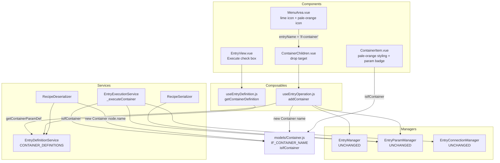
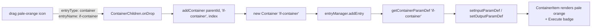
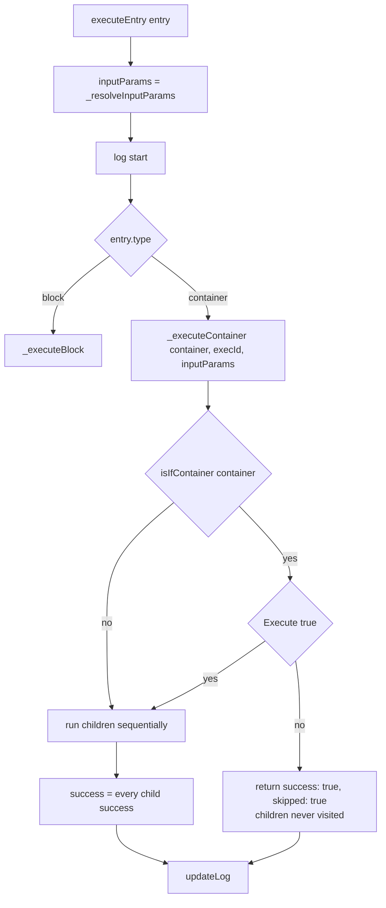

# if-container — Design Plan

Adds a second, pale-orange container icon to `MenuArea`. Dropping it creates an
**if-container**: a container that behaves exactly like the existing (lime) container
except that its children run only when its own boolean input parameter `Execute` is true.

Requirements (issue #36):

1. A pale-orange icon sits next to the existing container icon in `MenuArea`.
2. Dropping that icon creates an if-container object.
3. An if-container can hold containers and blocks, just like a plain container.
4. An if-container has one input parameter, `Execute`, of data type `boolean`.
5. The children of an if-container are executed only if `Execute` is TRUE.

---

## 1. Identification: the `name` field

An if-container is identified **solely by its `name`**. The string `'if-container'` is
passed to the `name` argument of the `Container` constructor at creation time:

```js
new Container('if-container')      // if-container
new Container('Container')         // plain container (unchanged)
new Container('root-container')    // recipe root (unchanged)
```

There is **no `subType` field and no new `type` value**. `type` stays `'container'` for
both kinds, so every existing `type === 'container'` branch keeps working untouched:

| Consumer | `type === 'container'` sites | Change needed |
|---|---|---|
| `EntryManager` | `_rebuildSequenceNumbers`, `_detachEntry`, `_removeDescendants`, `addEntry`, `removeEntry`, `reorderEntry`, `moveEntry`, `getAllDescendantIds`, `findContainerById`, `setParentChildRelation` | none |
| `EntryConnectionManager` | — (id-based only) | none |
| `EntryParamManager` | — (id-based only) | none |
| `ExecutionLogService` | stores `entry.type` verbatim | none |
| `ContainerChildren` | `child.type === 'block' ? BlockItem : ContainerItem` | none |

The name already carries this kind of meaning in the codebase — the recipe root is created
as `addContainer(null, 'root-container', 0)` (`RecipeItem.vue:74`) — and `name` is already
serialised for every node (`RecipeSerializer._serialiseEntry`), so the recipe schema needs
no field for the distinction at all.

### The constant and the predicate

`'if-container'` must not be spelled out in five places. It becomes a static on the model,
alongside the predicate that every consumer uses:

```js
// src/models/Container.js
export default class Container extends Entry {
  /** Reserved entry name that marks a container as an if-container. */
  static IF_CONTAINER_NAME = 'if-container';

  /**
   * @param {Entry|null} entry
   * @returns {boolean} True if the entry is a container named 'if-container'
   */
  static isIfContainer(entry) {
    return entry?.type === 'container' && entry.name === Container.IF_CONTAINER_NAME;
  }

  constructor(name = '', id = null) { /* unchanged */ }
}
```

Static class fields are already the house style for this (`BlockDefinitionManager.CTRL_TYPE_OPTIONS`,
`DATA_TYPE_OPTIONS`). The `type === 'container'` half of the predicate matters: it stops a
*block* that happens to be named `'if-container'` in `BlockDefinitions.json` from being
mistaken for one.

Because `name` is the discriminator, `'if-container'` becomes a **reserved entry name**.
See §11 for what that constrains.

---

## 2. Architecture



Layer placement follows `CLAUDE.md`: the discriminator lives in the model, the `Execute`
definition in a service, the wiring in a composable, and the managers are not touched.

---

## 3. The `Execute` parameter definition

Block parameters come from the user-editable `BlockDefinitions.json`. `Execute` must **not**
be user-editable or deletable, so it is defined in code, in `EntryDefinitionService`, in the
same shape as a block definition so the existing param plumbing accepts it as-is:

```js
// src/services/entry_definition/EntryDefinitionService.js
import Container from '../../models/Container.js';

static CONTAINER_DEFINITIONS = [
  {
    name: Container.IF_CONTAINER_NAME,
    parameters: {
      input: [{
        name: 'Execute',
        dataType: 'boolean',
        ctrlType: 'check_box',
        initial: true,
        items: [],
        comment: 'Children are executed only when this is true'
      }],
      output: []
    }
  }
];

/** @returns {Object|undefined} Container definition, or undefined for a plain container */
getContainerDefinition(containerName) {
  return EntryDefinitionService.CONTAINER_DEFINITIONS.find(d => d.name === containerName);
}

/** @returns {{input: Object, output: Object}} EntryParamManager-shaped defs (empty if none) */
getContainerParamDef(containerName) {
  return this._toParamDef(this.getContainerDefinition(containerName));
}
```

`getBlockParamDef()` and `getContainerParamDef()` then share one private
`_toParamDef(definition)` that does today's `convertValue(param.initial, param.dataType)`
mapping (`EntryDefinitionService.js:98-116`); the two public methods differ only in how
they look the definition up. A plain container resolves to `{ input: {}, output: {} }`,
so registering params for it is a no-op and its behaviour is unchanged.

`ctrlType: 'check_box'` maps to the existing `EntryParamCheckEdit` through
`EntryView.CTRL_TYPE_COMPONENTS`, and `dataType: 'boolean'` maps to the existing
`--param-badge-bg-color-boolean` badge styling. No new param widgets.

---

## 4. Creation flow



### `MenuArea.vue`

A second `.rect-item` with its own `useDraggable()` instance (the composable keeps its
state and callback per call, so two instances in one component are safe):

```html
<div class="rect-item">
  <div class="rect-icon lime" draggable="true"
       @dragstart="onDragStartContainer" @dragend="onDragEndContainer"></div>
</div>
<div class="rect-item">
  <div class="rect-icon pale-orange" draggable="true"
       @dragstart="onDragStartIfContainer" @dragend="onDragEndIfContainer"></div>
</div>
```

```js
const {
  onDragStart: onDragStartIfContainer,
  onDragEnd: onDragEndIfContainer,
  setOnDragStartCallback: setIfContainerDragStart
} = useDraggable()

setIfContainerDragStart((event) => {
  event.dataTransfer.setData('entryType', 'container')
  event.dataTransfer.setData('entryName', Container.IF_CONTAINER_NAME)
  event.dataTransfer.setData('sourceId', undefined)
})
```

`entryType` stays `'container'`, so `ContainerChildren.onDrop` (`ContainerChildren.vue:60-77`)
routes it to `addContainer` with no change at all — it already forwards `entryName`.

### `useEntryOperation.addContainer`

Currently `addContainer` registers no params. It becomes symmetrical with `addBlock`:

```js
const addContainer = (parentId, name, index) => {
  const newContainer = new Container(name)
  entryManager.addEntry(parentId, newContainer, index)
  const defaultParams = entryDefinitionService.getContainerParamDef(name)
  entryParamManager.setInputParamDef(newContainer.id, defaultParams.input)
  entryParamManager.setOutputParamDef(newContainer.id, defaultParams.output)
  return newContainer
}
```

**Ordering is load-bearing.** `EntryParamManager._inputParamsMap` is a plain `Map`, not
reactive, so `ContainerItem.hasParams` (`ContainerItem.vue:85-88`) is a `computed` over
non-reactive data — it caches its first result forever. The param defs must be registered
in the same synchronous tick as `addEntry`, before Vue flushes the render triggered by the
`children` mutation. `addBlock` already relies on exactly this; keep the same order.

`RecipeItem.vue:74` calls `addContainer(null, 'root-container', 0)`; that name has no
container definition, so the root gets `{}` / `{}` and is unaffected.

---

## 5. Rendering and styling

New variables in `src/assets/styles/variables.css`, next to the existing container block:

```css
/* If-container-related styles */
--if-container-bg-color: #f9d2a0;
--if-container-hover-bg-color: #f5c383;
--if-container-icon-border: 1px solid #e0a95f;
```

`ContainerItem.vue` gains a conditional class driven by the predicate:

```html
<div class="container-item" :class="{ dragging: isDragging, selected: isSelected, 'if-container': isIf }">
```

```js
const isIf = computed(() => Container.isIfContainer(props.entry))
```

```css
.container-item.if-container { background-color: var(--if-container-bg-color); }
.container-item.if-container .container-content-param { background-color: var(--if-container-bg-color); }
```

`MenuArea` icon:

```css
.rect-icon.pale-orange {
  background-color: var(--if-container-bg-color);
  border: var(--if-container-icon-border);
}
```

The header text is `{{ entry.name }}`, so an if-container displays `if-container` — the same
verbatim-name behaviour the plain container already has (it displays `Container`). See
assumption A2 if a friendlier label is wanted.

`ExecutionLogView` colours container rows with `--container-bg-color` via `.container-row`.
Tinting if-container rows differently would need `entryType` to carry the distinction, which
name-based identification deliberately avoids; the log already shows the entry name, so this
is left alone.

---

## 6. Editing and connecting `Execute`

Two UI paths exist for input params and both need only the definition lookup:

**Badge on the container header** — `ContainerItem.vue:19-24` already renders
`EntryParamsRow` when `hasParams`, which is simply never true for containers today.
Registering the def makes it true, and `EntryParamsRow` → `EntryParamBadge` gives the
connect/unlink UI for free. No template change beyond the styling class.

**Left-side `EntryView`** — `inputParamDefs` / `outputParamDefs` currently early-return `[]`
for anything that is not a block (`EntryView.vue:73-84`). They become type-dispatched:

```js
const entryDefinition = computed(() => {
  const entry = selectedEntry.value
  if (!entry) return null
  return entry.type === 'block'
    ? getBlockDefinition(entry.name)
    : getContainerDefinition(entry.name)
})
const inputParamDefs  = computed(() => entryDefinition.value?.parameters.input  ?? [])
const outputParamDefs = computed(() => entryDefinition.value?.parameters.output ?? [])
```

`useEntryDefinition` exposes a new `getContainerDefinition(name)` that forwards to the
service, mirroring the existing `getBlockDefinition`.

**Connections need nothing.** `EntryExecutionService._resolveInputParams(entryId)` already
runs for every entry including containers (`EntryExecutionService.js:149`), so wiring an
upstream boolean output into `Execute` works through the existing overlay. Two properties of
the existing connection UI apply automatically:

- `useSystemState.isConnectingTarget` requires the source's DFS sequence number to be lower
  than the target's, so the value feeding `Execute` must come from an entry **above** the
  if-container. A block *inside* the if-container cannot feed its own `Execute` — correct,
  since it would not have run yet.
- `endConnection` does not check data-type compatibility, so a non-boolean output can be
  wired into `Execute`. Coercion at the decision point handles it (§7, assumption A3).

---

## 7. Execution semantics



`executeEntry` already resolves `inputParams` before dispatching; it just has to pass them
down (`_executeContainer(entry, executionId)` → `_executeContainer(entry, executionId, inputParams)`):

```js
async _executeContainer(container, traceId, inputParams = {}) {
  let result = {};
  const childResults = [];
  try {
    if (Container.isIfContainer(container) && !this._shouldExecuteChildren(container, inputParams)) {
      return { success: true, skipped: true };
    }
    for (const childEntry of container.children) {
      childResults.push(await this.executeEntry(childEntry, traceId));
    }
    result.success = childResults.every(childResult => childResult.success === true);
  } catch (error) {
    result.errorMessage = error.message;
  }
  if (result.success === undefined) result.success = false;
  return result;
}

/**
 * Evaluate the 'Execute' condition of an if-container.
 * A connected upstream value arrives unconverted through _resolveInputParams,
 * so it is coerced here against the declared boolean type.
 * @private
 */
_shouldExecuteChildren(container, inputParams) {
  const raw = inputParams.Execute;
  if (raw === undefined) {
    console.warn(`[${this.constructor.name}] if-container ${container.id} has no "Execute" param — treating as true`);
    return true;
  }
  return convertValue(raw, 'boolean') === true;
}
```

Three decisions worth stating explicitly:

- **`success: true` when skipped.** A parent computes
  `childResults.every(r => r.success === true)`, so returning `false` for an untaken branch
  would fail the whole recipe. Not taking a branch is not an error.
- **Nesting is free.** Children are never visited when skipped, so a nested if-container
  inside a skipped one is skipped too, and no log rows appear for the subtree.
- **Missing `Execute` fails open** (runs children, with a warning) rather than silently
  swallowing work. This should not be reachable — the def is registered on creation and on
  deserialize — but a silently skipped subtree is very hard to debug, while a warning plus
  plain-container behaviour is obvious.

`convertValue` and `Container` become imports of `EntryExecutionService`.

### Log output column

`ExecutionLogView.formatOutputParams()` renders every key of `result` except `success` and
`errorMessage` (`ExecutionLogView.vue:96-101`), so `skipped: true` would leak into the
**Output** column as `skipped: true`. Add `'skipped'` to `excludedKeys`. Optionally, mark the
row: `entryRowClass` gains `'skipped-row': entry?.result?.skipped === true` with a dimmed
`opacity: 0.6`, which makes an untaken branch readable at a glance.

---

## 8. Persistence

The recipe node for a container already stores `name`, so **identification round-trips with
zero schema change**. Only the `Execute` *value* needs to be saved.

`RecipeSerializer._serialiseEntry` — emit `inputParams` for containers that have any:

```js
} else if (entry.type === 'container') {
  const inputParams = this.entryParamManager.getInputParams(entry.id)
  if (Object.keys(inputParams).length > 0) {
    node.inputParams = inputParams
  }
  node.children = entry.children.map(child => this._serialiseEntry(child))
}
```

The emptiness guard keeps plain-container and root nodes byte-identical to today.

`RecipeDeserializer._restoreEntries` — the container branch registers defs and restores the
saved value, with the same warning behaviour blocks get:

```js
if (node.type === 'container') {
  const container = new Container(node.name, node.id)
  this.entryManager.addEntry(parentId, container, index)
  idMap.set(node.id, container.id)

  const paramDefs = this.entryDefinitionService.getContainerParamDef(node.name)
  this.entryParamManager.setInputParamDef(container.id, paramDefs.input)
  this.entryParamManager.setOutputParamDef(container.id, paramDefs.output)
  this._restoreInputParams(container.id, node.inputParams, paramDefs.input, node.name, warnings)

  const children = Array.isArray(node.children) ? node.children : []
  children.forEach((childNode, childIndex) => {
    this._restoreEntries(childNode, container.id, childIndex, idMap, warnings)
  })
  return
}
```

`_restoreInputParams(entryId, saved, inputDefs, name, warnings)` is extracted from the
existing block branch (`RecipeDeserializer.js:138-145`) and used by both.

Two ordering facts already hold and must keep holding: entries are restored before
`_restoreConnections`, which validates `Execute` via
`Object.keys(getInputParams(input.entryId))` — so a connection into `Execute` survives a
round trip only because the container's params are registered inside `_restoreEntries`.

### `formatVersion`

Recommendation: bump `FORMAT_VERSION` to `2` **and** relax `_migrate` from strict equality
to a supported-versions list.

- Bumping alone (`_migrate`'s `data.formatVersion !== FORMAT_VERSION`, `RecipeDeserializer.js:32`)
  makes every existing v1 recipe unloadable.
- Not bumping lets an older build load an if-container recipe, ignore `node.inputParams` on
  the container, and run the branch **unconditionally** — a silent wrong result.

```js
// recipeFormat.js
export const FORMAT_VERSION = 2
export const SUPPORTED_FORMAT_VERSIONS = [1, 2]   // 1 -> 2 upgrade is a no-op
```

`_migrate` accepts any supported version and returns the data unchanged; v1 recipes simply
have no container `inputParams`, so if-containers (which cannot exist in a v1 recipe) are
not a concern and plain containers default to `{}`.

---

## 9. Files touched

| # | File | Change |
|---|---|---|
| 1 | `src/models/Container.js` | `IF_CONTAINER_NAME` static, `isIfContainer()` static |
| 2 | `src/services/entry_definition/EntryDefinitionService.js` | `CONTAINER_DEFINITIONS`, `getContainerDefinition`, `getContainerParamDef`, extract `_toParamDef` |
| 3 | `src/composables/useEntryDefinition.js` | expose `getContainerDefinition` |
| 4 | `src/composables/useEntryOperation.js` | `addContainer` registers param defs |
| 5 | `src/components/MenuArea.vue` | pale-orange icon, second `useDraggable`, CSS |
| 6 | `src/components/ContainerItem.vue` | `isIf` computed + `if-container` class, CSS |
| 7 | `src/components/EntryView.vue` | type-dispatched param defs |
| 8 | `src/assets/styles/variables.css` | `--if-container-*` variables |
| 9 | `src/services/entry_execution/EntryExecutionService.js` | pass `inputParams`, `_shouldExecuteChildren`, skip |
| 10 | `src/components/ExecutionLogView.vue` | exclude `skipped`; optional dimmed row |
| 11 | `src/services/entry_persistance/RecipeSerializer.js` | container `inputParams` |
| 12 | `src/services/entry_persistance/RecipeDeserializer.js` | container params, `_restoreInputParams`, version list |
| 13 | `src/services/entry_persistance/recipeFormat.js` | `FORMAT_VERSION = 2`, supported list |
| 14 | `src/services/entry_persistance/__tests__/EntryPersistanceService.test.js` | `expect(recipe.formatVersion).toBe(1)` → `2` (line 68); new if-container cases |
| 15 | `doc/if-container-add-plan.md` | this document |

Deliberately **not** touched: `EntryManager`, `EntryParamManager`, `EntryConnectionManager`,
`ExecutionLogService`, `ContainerChildren.vue`, `useDroppable.js`, `useSystemState.js`,
`public/settings/BlockDefinitions.json`.

---

## 10. Phasing

**Phase 1 — creation and appearance.** Items 1, 2, 3, 4, 5, 6, 8. Dropping the icon creates
a pale-orange container named `if-container` that holds children and shows an `Execute`
badge. It still executes unconditionally. Verifiable in isolation.

**Phase 2 — condition and log.** Items 7, 9, 10. `Execute` is editable in `EntryView`,
connectable from an upstream boolean output, and false skips the subtree.

**Phase 3 — persistence.** Items 11, 12, 13, 14. Save/load preserves the kind (via `name`)
and the `Execute` value.

---

## 11. Consequences of name-based identification

1. **`'if-container'` is a reserved entry name.** There is no entry-rename UI today (`name`
   is only ever set in a constructor, plus `root.name` on restore), so nothing can currently
   create a collision. Any future rename feature must reject `'if-container'` for a plain
   container — otherwise it would become an if-container with no `Execute` param, which
   §7's fail-open path would then run as a plain container.
2. **A hand-edited recipe can forge one.** Changing a saved container's `name` to
   `if-container` makes it one on load. That is consistent with how block `name` already
   resolves definitions on load, and `_restoreEntries` registers the `Execute` def by name,
   so the forged node behaves correctly (defaulting to `Execute = true`).
3. **A block named `if-container`** in `BlockDefinitions.json` is harmless — `isIfContainer`
   also requires `type === 'container'`.
4. **Adding a third container kind later** (`loop-container`, `while-container`) means one
   more `CONTAINER_DEFINITIONS` entry, one more name constant, and one more branch in
   `_executeContainer`. No changes to `EntryManager` or the recipe schema.

---

## 12. Test plan

Unit (`npm test`, Vitest — `package.json:11`; note `CLAUDE.md` still says no runner is
configured, which is stale):

- `Container.isIfContainer` — true for `new Container('if-container')`; false for
  `new Container('Container')`, for `new Block('if-container')`, and for `null`.
- `EntryDefinitionService.getContainerParamDef('if-container')` → `{ Execute: { value: true, dataType: 'boolean' } }`;
  `getContainerParamDef('Container')` → `{ input: {}, output: {} }`.
- `EntryExecutionService._executeContainer` with a stub `ScriptExecutionService`:
  `Execute` true runs all children; false returns `{ success: true, skipped: true }` and
  executes none; a failing child inside a taken branch still yields `success: false`; a
  nested if-container inside a skipped one is not visited.
- `_shouldExecuteChildren` coercion: `true` → run; `false` → skip; `'true'` → run;
  `'false'` → skip; `1` → skip (A3); `undefined` → run with a warning.
- Persistence round trip: if-container with `Execute = false` plus a child block, and an
  if-container whose `Execute` is fed by an upstream block's boolean output — restored
  `name`, `Execute` value and connection all survive, `warnings` empty.
- `_migrate` accepts `formatVersion` 1 and 2 and still rejects 999 (existing test at
  line 181 must keep passing).

Manual (`npm run dev`, and `npm run electron:start` for the persistence path):

1. Two icons in `MenuArea`; the second is pale orange.
2. Drag it into the recipe → a pale-orange container appears; header reads `if-container`.
3. Drop a block and a plain container inside it; both nest and reorder normally.
4. Select it → `EntryView` shows one input param `Execute` with a checked check box.
5. Uncheck it, Run → the log shows the if-container row with no child rows, status Success,
   and the Output column is empty (not `skipped: true`).
6. Re-check it, Run → children run in order.
7. Add a block above it whose output is boolean, connect that output to the `Execute` badge,
   Run → children run only when the upstream value is true. Confirm the badge cannot be
   targeted from a block *inside* the if-container.
8. Nest an if-container in an if-container; disable the outer → neither subtree runs and no
   inner rows appear in the log.
9. Save, reload, Load → colour, name and `Execute` state are restored; re-run matches.
10. Loading a recipe saved before this change still works (v1 accepted).
11. Delete an if-container that has a connection into `Execute` → the connection is removed
    with it (existing `removeEntry` path, no change expected).

---

## 13. Assumptions to confirm

- **A1 — `Execute` defaults to `true`.** A freshly dropped if-container runs its children
  until the user unchecks it. (The alternative, `false`, means a new if-container silently
  does nothing.)
- **A2 — the header displays `if-container` verbatim.** No display-label mapping, so `name`
  stays the single source of truth. If a nicer label such as `If` is wanted, it would be a
  presentation-only map in `ContainerItem` — the stored name stays `'if-container'`.
- **A3 — strict boolean coercion** via the existing `convertValue`: only `true` and
  `'true'` count as true, so a connected integer `1` counts as **false**. The alternative
  is JS truthiness for non-boolean sources.
- **A4 — a skipped branch reports `success: true`** so it does not fail the parent recipe.
- **A5 — `FORMAT_VERSION` bumps to 2** with `SUPPORTED_FORMAT_VERSIONS = [1, 2]`, so old
  recipes still load and old builds refuse new ones instead of mis-executing them.
