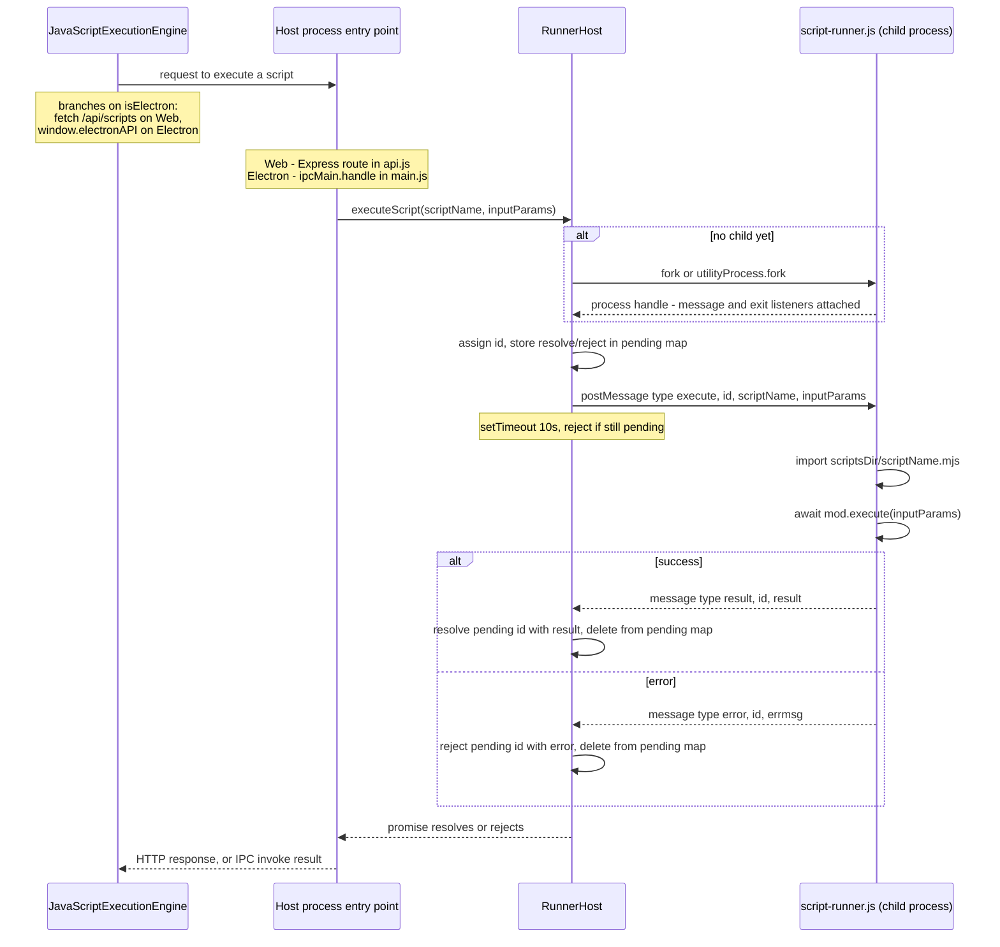
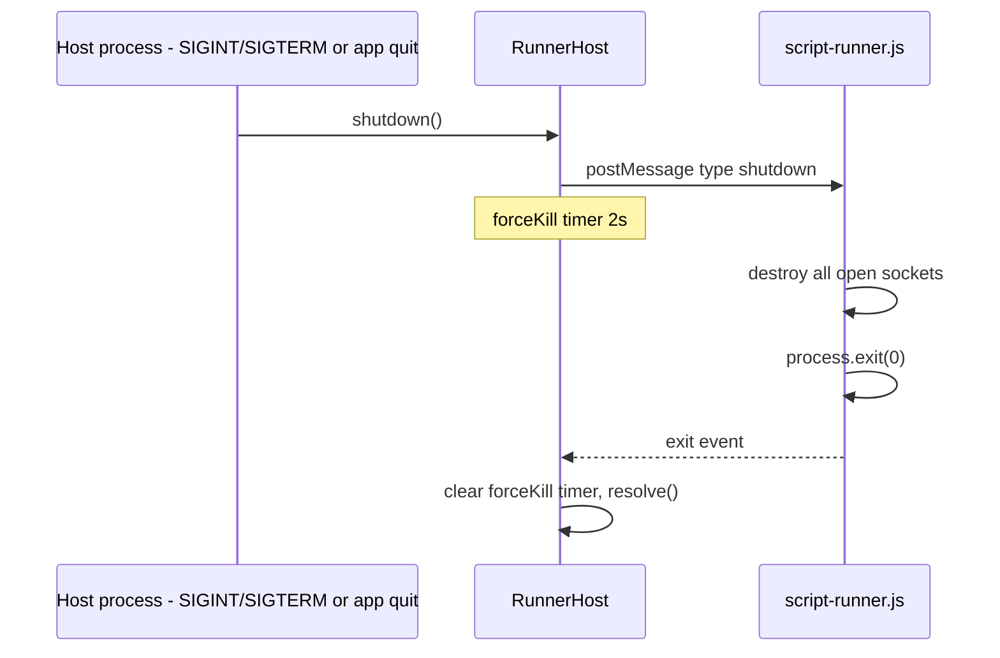

# Script Runner: Process Creation & IPC Workflow

Explains how a script execution request travels from the host process (Web
server or Electron main) into the forked `script-runner` child process and
back, via `RunnerHost`.

## Participants

- **Host process** — either `server/index.js` (Express/Node) or
  `electron/main.js` (Electron main process). Each owns one `RunnerHost`.
- **RunnerHost** (`shared/RunnerHost.js`) — shared class that lazily creates
  the child process and manages the request/response bookkeeping.
- **Child process** (`shared/script-runner.js`, bundled as `script-runner.cjs`
  for Electron) — runs user scripts from `<app-dir>/scripts/*.mjs` in
  isolation from the host.

Two different fork mechanisms are used depending on host, but both go through
the same `RunnerHost` and the same message contract:

| Host | Fork call | IPC surface used by child |
|---|---|---|
| Web server (`server/index.js`) | `child_process.fork()` | `process.send` / `process.on('message')` |
| Electron main (`electron/main.js`) | `utilityProcess.fork()` | `process.parentPort` |

`script-runner.js` checks `process.parentPort` first and falls back to
`process.send`, so the same file works under either host.

## 1. Lazy process creation

`RunnerHost` is constructed with a factory function, not a running process:

```js
// server/index.js
const runnerHost = new RunnerHost(() => fork(
  path.join(ROOT_DIR, 'shared', 'script-runner.js'),
  [appPaths.scriptsDir]
))
```

No child process exists yet at this point. `RunnerHost._ensureProcess()`
calls the factory the first time any method (`executeScript`, `createSocket`,
`destroySocket`) is invoked, and caches the result:

```js
_ensureProcess() {
  if (this._process) return this._process
  const proc = this._forkFn()
  proc.on('message', (msg) => this._handleMessage(msg))
  proc.on('exit', () => { /* reject all pending calls, clear this._process */ })
  this._process = proc
  return proc
}
```

The scripts directory (`appPaths.scriptsDir`) is passed as a CLI argument
(`argv[2]`), so the child knows where to load scripts from without any IPC
round trip.

## 2. Sequence: an `executeScript` call end to end



Key points:

- **Single client-side caller, two entry points**: `JavaScriptExecutionEngine.executeScript()`
  (`client/services/script_execution/JavaScriptExecutionEngine.js`) branches
  on `this.isElectron`. On the Web target it does a `fetch` to
  `/api/scripts/:name/execute`, handled by the Express route in
  `server/api.js`. On Electron it calls `window.electronAPI.executeScript(...)`
  (exposed via `contextBridge` in `electron/preload.js`), handled by
  `ipcMain.handle('script:execute', ...)` in `electron/main.js`. Both entry
  points do nothing more than forward to `runnerHost.executeScript(...)`.
- **Correlation by `id`**: every call increments `RunnerHost._counter` and
  stores `{resolve, reject}` in `_pending` keyed by that id. The child echoes
  the same `id` back in its reply so `_handleMessage` can look up and settle
  the right promise. This lets multiple in-flight requests share one child
  process without cross-talk.
- **Message shape in**: `{ type: 'execute' | 'createSocket' | 'destroySocket' | 'shutdown', id, ...args }`.
- **Message shape out**: `{ type: 'result' | 'error', id, result? , errmsg? }`.
- **Timeout safety net**: `executeScript` gives up after 10s (`createSocket`
  5-10s) and rejects/resolves locally even if the child never replies —
  guards against a hung script.
- **`createSocket`/`destroySocket` never reject**: their pending entry uses
  `resolve` for both slots (`{ resolve, reject: resolve }`), so a timeout or
  child error just resolves with `null`/`false` instead of throwing.

## 3. Script execution inside the child

`shared/script-runner.js` listens for messages and dispatches by `type`:

```js
function onMessage(msg) {
  if (msg.type === 'execute') handleExecute(msg)
  else if (msg.type === 'createSocket') handleCreateSocket(msg)
  else if (msg.type === 'destroySocket') handleDestroySocket(msg)
  else if (msg.type === 'shutdown') { /* destroy sockets, process.exit(0) */ }
}
```

`handleExecute` validates the script name against `SCRIPT_NAME_PATTERN`
(prevents path traversal), dynamically `import()`s the `.mjs` file from the
scripts directory, calls its exported `execute(inputParams)`, and reports the
result or error back over IPC. Because scripts are loaded via dynamic
`import()` in an isolated process, a crash or infinite loop in a user script
does not take down the host process.

Sockets opened via `createSocket` are kept in an in-child `Map<socketId,
net.Socket>` so a script can reuse a connection across multiple calls; they
self-clean on `close` and are all destroyed on `shutdown`.

## 4. Shutdown



If the child doesn't exit within 2 seconds of the shutdown message, `RunnerHost`
force-kills it via `proc.kill()`.

## Files involved

- [server/index.js](../server/index.js) — Web host, creates `RunnerHost` with `child_process.fork`.
- [electron/main.js](../electron/main.js) — Electron host and Electron entry point, creates `RunnerHost` with `utilityProcess.fork` and handles `ipcMain.handle('script:execute', ...)`.
- [shared/RunnerHost.js](../shared/RunnerHost.js) — request/response bookkeeping, timeouts, shutdown.
- [shared/script-runner.js](../shared/script-runner.js) — child process entry point, message dispatch, script loading.
- [server/api.js](../server/api.js) — Web entry point, Express routes calling `runnerHost.executeScript/createSocket/destroySocket`.
- [electron/preload.js](../electron/preload.js) — exposes `window.electronAPI.executeScript/createSocket/destroySocket` to the renderer via `contextBridge`.
- [client/services/script_execution/JavaScriptExecutionEngine.js](../client/services/script_execution/JavaScriptExecutionEngine.js) — client-side caller; branches on `isElectron` to reach either entry point.
