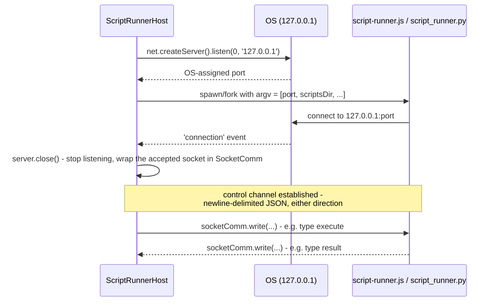
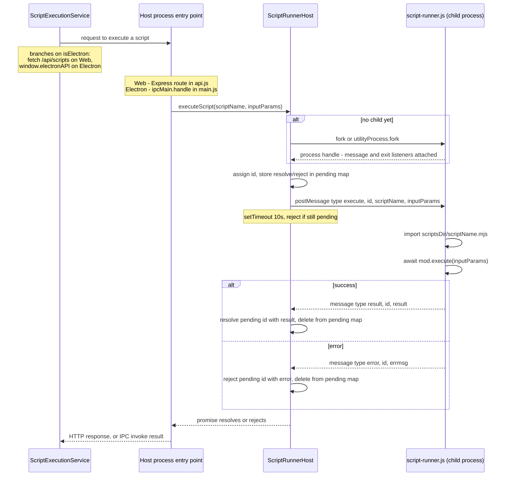
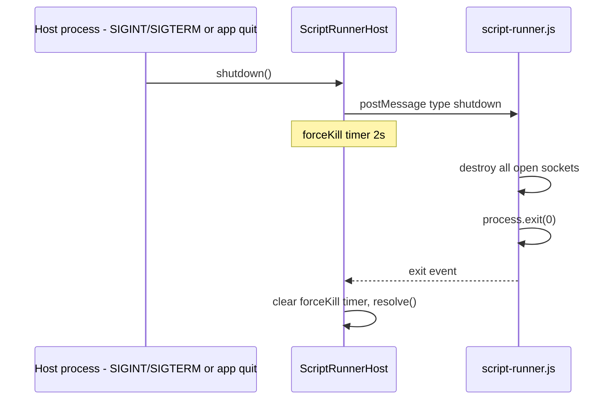

# Script Runner: Process Creation & IPC Workflow

Explains how a script execution request travels from the host process (Web
server or Electron main) into a child process and back. Both interpreters
are driven by the same `ScriptRunnerHost` class (`shared/ScriptRunnerHost.js`);
only the child process it spawns differs, selected once at host startup by
the `interpreterName` field in `appdata/settings/AppSettings.json`
(`"javascript"`, the default, or `"python"`) — never both at once, since the
interpreter is a single app-wide setting:

- **JavaScript**: `ScriptRunnerHost` forks `shared/script-runner.js`.
- **Python**: `ScriptRunnerHost` spawns `appdata/python/script_runner.py` as
  a plain subprocess.

Either way, `ScriptRunnerHost` talks to the child over a TCP loopback socket
it listens on itself (see "1. Lazy process creation" and "2. `ScriptRunnerHost`'s
control channel to the child process" below). Using a plain socket for both
lets JavaScript and Python share one wire protocol (`shared/SocketComm.js`
on the Node side, `appdata/python/socket_comm.py` on the Python side, both
framing one JSON object per line). See "5. Python execution" below for
what's specific to the Python worker.

Because it's the same class either way, the rest of the host process
(`ipcMain.handle` / Express routes) doesn't need to know which interpreter is
active — it just calls `executeScript(scriptName, inputParams)` /
`shutdown()`.

## Participants

- **Host process** — either `server/index.js` (Express/Node) or
  `electron/main.js` (Electron main process). Each owns one host (a
  `ScriptRunnerHost` or a `PythonRunnerHost`, chosen once at startup — see
  "5. Python execution").
- **ScriptRunnerHost** (`shared/ScriptRunnerHost.js`) — shared class that lazily creates
  the child process and manages the request/response bookkeeping.
- **Child process** (`shared/script-runner.js`, bundled as `script-runner.cjs`
  for Electron) — runs user scripts from `<app-dir>/scripts/*.mjs` in
  isolation from the host.

Two different fork mechanisms are used depending on host, but both go through
the same `ScriptRunnerHost` and the same message contract:

| Host | Fork call | IPC surface used by child |
|---|---|---|
| Web server (`server/index.js`) | `child_process.fork()` | `process.send` / `process.on('message')` |
| Electron main (`electron/main.js`) | `utilityProcess.fork()` | `process.parentPort` |

`script-runner.js` checks `process.parentPort` first and falls back to
`process.send`, so the same file works under either host.

Sections 1-4 below describe the JavaScript path (`ScriptRunnerHost`/`script-runner.js`).
See "5. Python execution" for the parallel `PythonRunnerHost`/`script_runner.py` path.

## 1. Lazy process creation

`ScriptRunnerHost` is constructed with a factory function, not a running process:

```js
// server/index.js
const runnerHost = new ScriptRunnerHost(() => fork(
  path.join(ROOT_DIR, 'shared', 'script-runner.js'),
  [appPaths.scriptsDir]
))
```

No child process exists yet at this point. `ScriptRunnerHost._ensureProcess()`
calls the factory the first time any method (`executeScript`, `createSocket`,
`destroySocket`) is invoked, and caches the result:

```js
_ensureProcess() {
  if (this._process) return this._process
  const proc = this._forkFn()
  proc.on('message', (msg) => this._handleMessage(msg))
  proc.on('exit', () => { /* reject all pending calls, clear this._process */ })
  this._process = proc
  return proc
}
```

The scripts directory (`appPaths.scriptsDir`) is passed as a CLI argument
(`argv[2]`), so the child knows where to load scripts from without any IPC
round trip.

## 2. `ScriptRunnerHost`'s control channel to the child process

`ScriptRunnerHost` and its child (`script-runner.js` for JavaScript,
`script_runner.py` for Python) talk over a single TCP socket instead of the
launching mechanism's own IPC primitive (`process.send`/`parentPort`,
stdin/stdout). The host is the TCP *server*; the child is the *client* that
dials back in, which is necessary because the port has to exist before the
child can be spawned with it:



Key points:

- **Exactly one connection**: `server.once('connection', ...)` accepts only
  the child's connection, then `server.close()` stops listening. From then
  on the channel *is* that one accepted socket, not the server.
- **Wire format implemented twice, identically**: `shared/SocketComm.js`
  (used by `ScriptRunnerHost` itself, and reused by `script-runner.js` for
  its own end of the socket) and `appdata/python/socket_comm.py` (used by
  `script_runner.py`) both frame messages as one JSON object per line.
  `write()` appends `\n`; the reader buffers incoming bytes and only invokes
  `onMessage()`/`on_message()` once a full line has arrived, so a single
  `data` event or `recv()` chunk can contain zero, one, or several complete
  messages.
- **Two usage styles on `SocketComm`**: `write()`/`onMessage()` is a
  continuous, uncorrelated pair — the control channel here uses this,
  correlating requests/responses itself via the `id` field described in
  section 2. `request(data)` is a strict one-shot round trip used elsewhere
  (the socket handed to a user script's `execute()` via `createSocket`), not
  on this host/child control channel.
- **argv contract**: both children see the port then the scripts dir, just
  at different indices, because each runtime reserves a different number of
  leading argv slots before the arguments passed by `spawnFn` begin:
  Node's `process.argv[0]` is the node executable and `argv[1]` is the
  script path, so the passed-in arguments start at `argv[2]`.
  Python's `sys.argv[0]` is the script path, so they start one index earlier, at `argv[1]`.

  | Child | argv: port | argv: scripts dir |
  |---|---|---|
  | `script-runner.js` (JS) | `argv[2]` | `argv[3]` |
  | `script_runner.py` (Python) | `sys.argv[1]` | `sys.argv[2]` |

## 2. Sequence: an `executeScript` call end to end



Key points:

- **Single client-side caller, two entry points**: `ScriptExecutionService.executeScript()`
  (`client/services/script_execution/ScriptExecutionService.js`) branches
  on `this.isElectron`. On the Web target it does a `fetch` to
  `/api/scripts/:name/execute`, handled by the Express route in
  `server/api.js`. On Electron it calls `window.electronAPI.executeScript(...)`
  (exposed via `contextBridge` in `electron/preload.js`), handled by
  `ipcMain.handle('script:execute', ...)` in `electron/main.js`. Both entry
  points do nothing more than forward to `runnerHost.executeScript(...)`.
- **Correlation by `id`**: every call increments `ScriptRunnerHost._counter` and
  stores `{resolve, reject}` in `_pending` keyed by that id. The child echoes
  the same `id` back in its reply so `_handleMessage` can look up and settle
  the right promise. This lets multiple in-flight requests share one child
  process without cross-talk.
- **Message shape in**: `{ type: 'execute' | 'createSocket' | 'destroySocket' | 'shutdown', id, ...args }`.
- **Message shape out**: `{ type: 'result' | 'error', id, result? , errmsg? }`.
- **Timeout safety net**: `executeScript` gives up after 10s (`createSocket`
  5-10s) and rejects/resolves locally even if the child never replies —
  guards against a hung script.
- **`createSocket`/`destroySocket` never reject**: their pending entry uses
  `resolve` for both slots (`{ resolve, reject: resolve }`), so a timeout or
  child error just resolves with `null`/`false` instead of throwing.

## 3. Script execution inside the child

`shared/script-runner.js` listens for messages and dispatches by `type`:

```js
function onMessage(msg) {
  if (msg.type === 'execute') handleExecute(msg)
  else if (msg.type === 'createSocket') handleCreateSocket(msg)
  else if (msg.type === 'destroySocket') handleDestroySocket(msg)
  else if (msg.type === 'shutdown') { /* destroy sockets, process.exit(0) */ }
}
```

`handleExecute` dynamically `import()`s the `.mjs` file from the scripts
directory (the script name is already validated against
`SCRIPT_NAME_PATTERN` by `ScriptRunnerHost.executeScript` before the
`execute` message is sent, preventing path traversal), calls its exported
`execute(inputParams)`, and reports the result or error back over IPC.
Because scripts are loaded via dynamic
`import()` in an isolated process, a crash or infinite loop in a user script
does not take down the host process.

Sockets opened via `createSocket` are kept in an in-child `Map<socketId,
net.Socket>` so a script can reuse a connection across multiple calls; they
self-clean on `close` and are all destroyed on `shutdown`.

## 4. Shutdown



If the child doesn't exit within 2 seconds of the shutdown message, `ScriptRunnerHost`
force-kills it via `proc.kill()`.

## 5. Python execution

When `appdata/settings/AppSettings.json`'s `script.interpreterName` is `"python"`,
the host constructs a `PythonRunnerHost` instead of a `ScriptRunnerHost`. Both
classes expose the same `executeScript`/`shutdown` shape, so `ipcMain.handle`
and the Express route are unaware of which one is active — this decision is
made once, at host startup, by reading `AppSettings.json` directly (there's
no renderer-side IPC for it; the renderer's `ScriptExecutionService` sends
exactly the same `executeScript(scriptName, inputParams)` call either way).

The Python worker (`appdata/python/script_runner.py`) is a persistent process, like
`script-runner.js`, but since a plain `child_process.spawn`'d process can't
join Node's native IPC channel, the protocol is one JSON object per line
(NDJSON) over stdin/stdout instead:

- **in** (written to the worker's stdin): `{"type": "execute", "id": <int>, "scriptName": <str>, "inputParams": {...}}`, or `{"type": "shutdown"}`.
- **out** (read from the worker's stdout, one line per response): `{"type": "result", "id": <int>, "result": {...}}` or `{"type": "error", "id": <int>, "errmsg": <str>}`.

`PythonRunnerHost._handleChunk()` buffers partial stdout chunks and splits on
`\n` to reconstruct complete lines before parsing, since `data` events can
split a line arbitrarily. Correlation by `id`, the 10s execute timeout, and
the shutdown grace-period/force-kill behavior all mirror `ScriptRunnerHost`
exactly. `createSocket`/`destroySocket` are stubbed to resolve `null`/`false`
on `PythonRunnerHost` — Python scripts don't get the TCP socket passthrough
feature.

The worker resolves `<scriptsDir>/<scriptName>.py` (passed as `argv[1]` at
spawn time, mirroring `script-runner.js`'s own `argv[2]`), loads it via
`importlib.util`, and calls its exported `execute(input_params)`. The result
may be a coroutine (`async def execute`) — the worker detects this and drives
it with `asyncio.run()`. While running user code, `sys.stdout` is redirected
to `sys.stderr` so a stray `print()` can't corrupt the one-JSON-line-per-
response protocol; it still surfaces via `PythonRunnerHost`'s
`[python-runner]`-prefixed stderr logging, matching how `script-runner.js`'s
own stdout/stderr are logged today.

## Files involved

- [server/index.js](../server/index.js) — Web host, reads `AppSettings.json` and creates either `ScriptRunnerHost` (`child_process.fork`) or `PythonRunnerHost` (`child_process.spawn`).
- [electron/main.js](../electron/main.js) — Electron host and entry point; same choice, using `utilityProcess.fork` for `ScriptRunnerHost` and `child_process.spawn` for `PythonRunnerHost`; handles `ipcMain.handle('script:execute', ...)`.
- [shared/ScriptRunnerHost.js](../shared/ScriptRunnerHost.js) — JavaScript-child request/response bookkeeping, timeouts, shutdown.
- [shared/PythonRunnerHost.js](../shared/PythonRunnerHost.js) — Python-worker NDJSON request/response bookkeeping, timeouts, shutdown.
- [shared/script-runner.js](../shared/script-runner.js) — JS child process entry point, message dispatch, script loading. Unaffected by Python support.
- [appdata/python/script_runner.py](../appdata/python/script_runner.py) — Python worker entry point, NDJSON request loop, script loading.
- [shared/appDataPaths.js](../shared/appDataPaths.js) — `readAppSettings()`, shared by both hosts to resolve `script.interpreterName`/`script.interpreterPath` once at startup.
- [server/api.js](../server/api.js) — Web entry point, Express routes calling `runnerHost.executeScript/createSocket/destroySocket`.
- [electron/preload.js](../electron/preload.js) — exposes `window.electronAPI.executeScript/createSocket/destroySocket` to the renderer via `contextBridge`.
- [client/services/script_execution/ScriptExecutionService.js](../client/services/script_execution/ScriptExecutionService.js) — client-side caller; branches on `isElectron` to reach either entry point.
