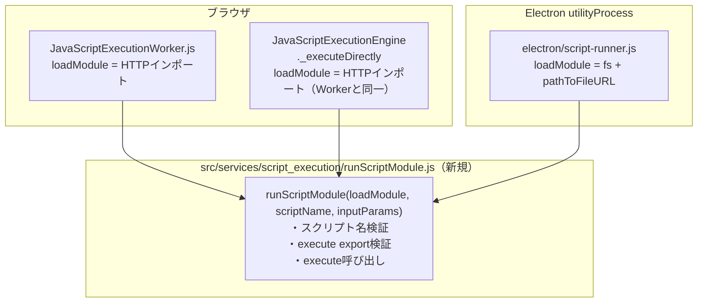

# スクリプト実行ロジック共通化 リファクタリング案

**作成日**: 2026-08-24
**背景**: `doc/Webサーバ実行形態_要求仕様書.md` の適用を検討する過程で、同仕様書4.2節が前提とする「スクリプト実行ロジックの共通化」が実際には未達成（3箇所に重複実装）であることが判明した。Web版追加の前段階として、この重複を解消する。

---

## 現状の重複と差分

3箇所とも実質的に同じ処理をしている。

```
モジュールをロード → execute関数がexportされているか検証 → execute(inputParams)を呼ぶ → 結果/エラーを返す
```

違うのはモジュールの**ロード方法**だけ。

| 箇所 | ロード方法 |
|---|---|
| `JavaScriptExecutionWorker.js`（ブラウザWorker） | `import(`/scripts/${name}.mjs`)` — HTTP経由 |
| `JavaScriptExecutionEngine._executeDirectly`（ブラウザ直接実行フォールバック） | 同上（Workerと全く同じ） |
| `electron/script-runner.js`（Electron utilityProcess） | `pathToFileURL(path.join(scriptsDir, name+'.mjs'))` — ファイルシステム経由、かつスクリプト名を`SCRIPT_NAME_PATTERN`で検証 |

副次的な発見: `electron/main.js`・`electron/script-runner.js`はどちらも`@electron-forge/plugin-vite`によって個別のVite設定（`vite.main.config.js`/`vite.runner.config.js`）でビルドされている。つまりElectron側もVite経由でESMの`import`が使える。これにより、`src/`配下に置いた共通モジュールをブラウザ側・Electron側の両方から`import`で直接参照できる（`script-runner.js`は現在CommonJS `require()`で書かれているが、ESM `import`構文に書き換えればそのままViteがバンドルする）。

## 提案: `runScriptModule` を共通コアとして切り出す



`runScriptModule.js`は環境依存API（`window`、`node:*`）に一切依存しない純粋関数として書く。

```js
// src/services/script_execution/runScriptModule.js
const SCRIPT_NAME_PATTERN = /^[A-Za-z0-9_-]+$/

export async function runScriptModule(loadModule, scriptName, inputParams) {
  if (!SCRIPT_NAME_PATTERN.test(scriptName)) {
    throw new Error(`Invalid script name: ${scriptName}`)
  }
  const mod = await loadModule(scriptName)
  if (typeof mod.execute !== 'function') {
    throw new Error(`Script "${scriptName}" does not export an execute function`)
  }
  return await mod.execute(inputParams)
}
```

呼び出し側は「どこからモジュールをロードするか」だけを渡す薄いアダプタになる。

```js
// electron/script-runner.js（抜粋・ESM化後）
import { runScriptModule } from '../src/services/script_execution/runScriptModule.js'

async function handleExecute({ id, scriptName, inputParams }) {
  try {
    const result = await runScriptModule(
      (name) => import(pathToFileURL(path.join(scriptsDir, `${name}.mjs`)).href),
      scriptName,
      inputParams
    )
    send({ type: 'result', id, result })
  } catch (error) {
    send({ type: 'error', id, errmsg: error.message })
  }
}
```

ブラウザ側の`JavaScriptExecutionWorker.js`と`JavaScriptExecutionEngine._executeDirectly`も同様に`loadModule`だけを`(name) => import(`/scripts/${name}.mjs`)`にして`runScriptModule`を呼ぶ形に置き換える。

## この提案のメリット

- 将来のWebサーバー版のスクリプトランナーも、この`runScriptModule`をそのまま再利用できる（`electron/script-runner.js`のNode child_processフォールバックが既にElectron非依存なので、Web版のサーバープロセスはこのファイルをほぼそのまま流用可能）。
- スクリプト名のパストラバーサル対策（`SCRIPT_NAME_PATTERN`）が共通コアに一元化され、ブラウザ側にも自動的に適用される（現状ブラウザ側は未検証）。
- `execute` export検証・エラーメッセージの形が3箇所でバラバラだったのが統一される。

## スコープ外にすること（別タスク推奨）

- `electron/main.js`内の`SCRIPT_NAME_PATTERN`（`scripts:list/read/save`用）は今回のリファクタリング対象外とする。これは「スクリプト一覧取得・保存」という別機能の話で、実行ロジックの重複とは別問題のため。
- `JavaScriptExecutionEngine`の`pendingExecutions`Map/`executionCounter`（Worker用ID相関管理）と、`electron/main.js`の`executeScriptInRunner`が持つ同種のMap/カウンタも、実は似た「ID相関のリクエスト/レスポンス管理」を重複実装しているが、これは「スクリプト実行ロジック」ではなく「メッセージング層」の重複であり、今回のスコープには含めない（Web版でWebSocketを使う際に3つ目の重複が生まれる可能性はあるが、それは別途検討）。

## 動作確認方針

- `runScriptModule.js`用のユニットテスト（`__tests__/`、モックの`loadModule`で正常系/execute未export/スクリプト名不正の3パターン）を新規追加。
- 既存のブロック実行がブラウザ（`npm run dev`）とElectron（`npm run electron:start`）の両方で壊れていないことを手動確認（`add`等の同梱スクリプトを実行）。
